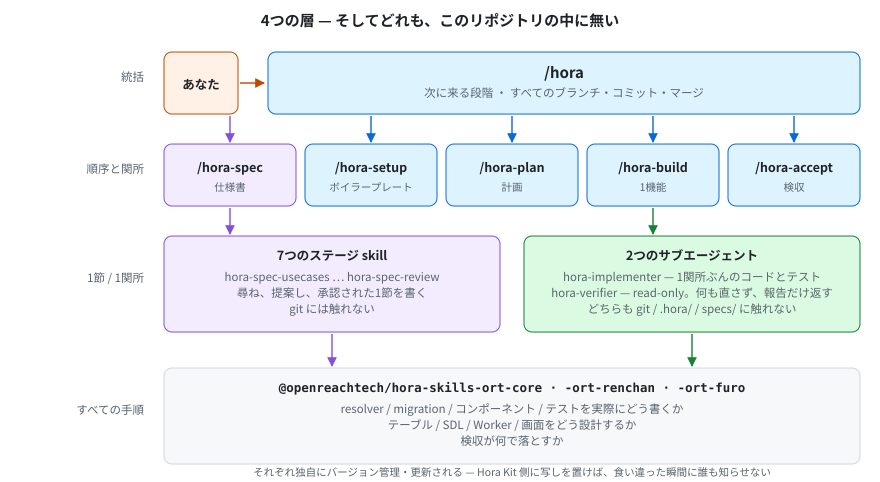
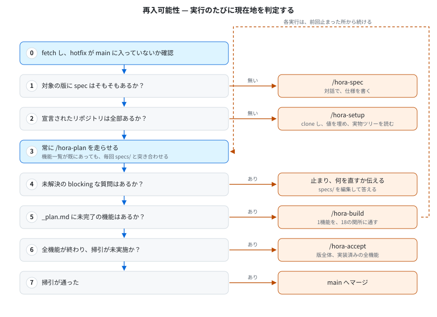
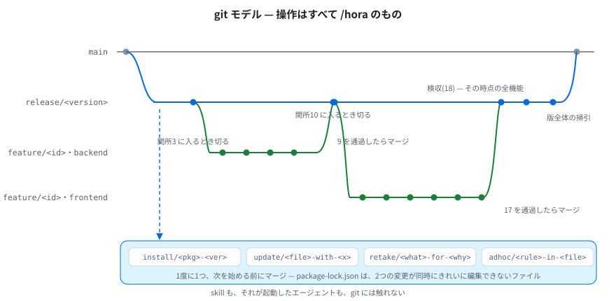
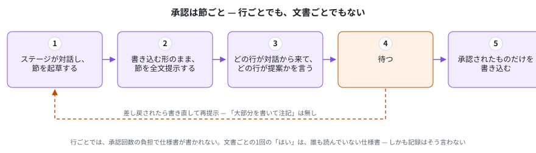

<!-- English: [architecture.md](./architecture.md) — 片方を直したら、同じコミットでもう片方も直してください -->

# タスク実行アーキテクチャ

*[English](./architecture.md)*

Hora Kit が仕様書をアプリケーションに変えるまで。何がどこで動き、状態はどこにあり、なぜ全体が直列なのか。

このドキュメントは設計の説明です。**個々の規則の権威ではありません** — 規則はそれを所有する skill にあり、ここからはリンクします。

---

## 目次

- [2つの半分](#2つの半分)
- **[第1部 /hora — アプリケーションを建てる](#第1部-hora--アプリケーションを建てる)**
  - [4つの層](#4つの層)
  - [層ごとではなく、機能ごと](#層ごとではなく機能ごと)
  - [何がどこで動くか、そしてなぜ](#何がどこで動くかそしてなぜ)
  - [状態モデル](#状態モデル)
  - [再入可能性](#再入可能性)
  - [git モデル](#git-モデル)
  - [なぜ直列なのか](#なぜ直列なのか)
- **[第2部 /hora-spec — 何を作るかを決める](#第2部-hora-spec--何を作るかを決める)**
  - [「読むこと」は「推測すること」ではない](#読むことは推測することではない)
  - [ステージ0、そして7つのステージ、順番に](#ステージ0そして7つのステージ順番に)
  - [なぜ全ステージが対話なのか](#なぜ全ステージが対話なのか)
  - [承認は節ごと](#承認は節ごと)
  - [仕様実行の状態](#仕様実行の状態)
  - [両方を支える2つの境界](#両方を支える2つの境界)
  - [次に読むもの](#次に読むもの)

---

## 2つの半分

**Hora Kit は、1つの文書を共有する2台の機械です。** `/hora-spec` が、製品を望む人と対話しながら**何を作るか**を決めます。`/hora` が、その文書が言っていることを**作ります**。2つが共有するのは `specs/<version>/spec.md` だけで、だからこそ、それぞれを単独で説明できます。


| | `/hora-spec` | `/hora` |
|---|---|---|
| **産み出すもの** | `specs/<version>/spec.md` | 実装リポジトリ、および `.hora/` |
| **作業の単位** | 仕様書の1節。書き込む前に承認を取る | 1つの機能。18の関所を通す |
| **穴があったときの動き** | 尋ね、提案し、承認されたものだけを書く | 止まり、`specs/` の何を直すかを伝える |
| **決してしないこと** | 誰も承認していない設計。git / `.hora/tasks/` / 実装リポジトリへの接触 | 要件の発明。1つの狭い例外を除く `specs/` への書き込み |

**時間の順序では、仕様の側が先です。** この文書が `/hora` を先に置いているのは、機構の大半がそちらにあり、また仕様の側は「その出力を誰が読むのか」が分かってからの方が読みやすいためです。

**2つの半分は、必要とする注意の量も違います。そして推奨される走らせ方は、その違いに従っています。** `/hora-spec` はステージごとに付き添う価値があります — 最初から最後まで対話であり、仕様書が「機能名の一覧」で終わらなくなる場所だからです。実装の側は走らせておけます — **答えが要るときは、決めずに止まる**ので。自動執行がこちらでは安全で、もう片方ではそうでない理由は、それです。[`README.ja.md`](../README.ja.md) の「推奨：仕様は対話で、実装は自動執行で」を参照してください。

**この文書は2部構成です。** 第1部は `/hora` — 4つの層、18の関所、状態、再入可能性、git、そしてなぜ直列なのか。第2部は `/hora-spec` — 既にあるものを読むこと、7つのステージ、なぜその全部が対話なのか、そして承認の仕組みです。

---

# 第1部 /hora — アプリケーションを建てる

## 4つの層



| 層 | 決めること | 決してしないこと | 配布元 |
|---|---|---|---|
| `/hora` | 次にどの段階が来るか。すべてのブランチ・コミット・マージ | 作業の中身に関する一切 | `@openreachtech/hora` |
| 5つの skill | 作業の順序と、各関所の終了条件 | その書き方 | `@openreachtech/hora`。ただし `/hora-setup` はプロジェクトの boilerplate が配布 |
| ステージ skill と2つの agent | 仕様書の1節、あるいは1関所ぶんのコードや判定 | 順序上の位置。git に関する一切 | `@openreachtech/hora` |
| 4つのスキルパッケージ | **すべての手順と、すべての合否基準** | それが呼ばれる時機 | `@openreachtech/hora-skills-ort-core`・`-ort-renchan`・`-ort-furo`・`-ort-support` |

**4つの層のどれにも属さない skill が1つだけあり、それは `/hora` が決して起動しない唯一の skill です — `/hora-hotfix`。** 作業の順序も、関所の終了条件も決めません。何を緊急とするかは人が決めることだからです。直接呼ばれ、release ラインではなく `main` の上で動き、その結果の上に `/hora` が開いている release ライン群を rebase します。配布元は他と同じ `@openreachtech/hora` です。[`commands.ja.md`](./commands.ja.md) の `/hora-hotfix` と、経路全体を書いた [`hotfix.ja.md`](./hotfix.ja.md) を参照してください。

**4つのどれも、このリポジトリの中にはありません。** 4層すべてがパッケージとして届き、このリポジトリが持つのは仕様書と、これらの文書と、`.hora/` にある実行自身の記録です。

**驚かれるのは、パッケージ2つの間の分割です。** Hora Kit は resolver や migration やコンポーネントの書き方を一切持っていません。持ってはいけません — それらは独自にバージョン管理・更新されるパッケージにあります。Hora Kit 側に写しを置けば、そのパッケージが動いた瞬間に食い違い、しかも**食い違ったことを誰も知らせません。** [`structure.md`](../kit/skills/hora/references/structure.md) の "The division of labor" と [`structure.md`](../kit/skills/hora/references/structure.md) を参照してください。

---

## 層ごとではなく、機能ごと

1つの機能が、仕様 → バックエンド → フロントエンド → 検収 と進みます。**検収を通ってはじめて次の機能が始まります。**


**もう一方のやり方を書いておく価値があります。そちらが普通のやり方だからです。** バックエンドのタスクを全部、次にフロントエンドのタスクを全部、最後にテスト — この順序では、ある機能が**動くかどうか**が分かるのは全部書き終えた後です。そして、たとえば20機能を持つ版なら、データモデルの不足はその時点で20機能ぶんの下敷きになっており、その全部がそれの上に建っています。**この20は例です。版が持つ機能数はプロジェクトごとに違い、以下この節では同じ例を使います。**

| | 層ごと | 機能ごと |
|---|---|---|
| 設計の不備が表に出る時点 | 最後のテスト段階 | その機能自身の検収 |
| その時点で上に積まれている量 | 全部 | ゼロ |
| 退行の見え方 | その20の変更のどれかが壊した | **今入れた変更が壊した** |
| コスト | 環境の立ち上げ1回 | 機能ごとに1回 |

コストは実在し、承知の上で受け入れています。機能ごとにコンテナ群を立ち上げる手間は、間違ったテーブルの上に建てたその20機能を解きほぐす手間に比べれば安いためです。

**退行の網が累積であることが、上の表の3行目を成立させています。** [`/hora-accept`](../kit/skills/hora-accept/SKILL.md) はどの関所でも**ユニットスイートをリポジトリ全体に対して**流します。したがって、ある機能が過去の機能を壊した場合、壊したその実行で落ちます。高コストな側 — 実ブラウザで画面を駆動するレビュー — は関所ではその機能自身に絞られ、全機能を端から端まで駆動するのは版全体のスイープ（または明示的に要求した実行）の仕事です。

**この順序で作ることは、仕様に1つ条件を課します。見落としやすい条件です — 機能の受入基準は、その機能自身の関所で達成可能でなければなりません。** 後から作る機能を名指す基準は、それを読むどの関所でも満たせません。それでも4つの実行がその基準に対して動きます — 関所1は基準を読んで作り、6と16は基準ごとにテストを書き、18はその機能を落として他人の関所へ差し戻します。**そのため受入基準は二段になっています。** 機能ごとの基準は、その機能とその `depends` までが作られていて後は何も無い製品に対して確認されます。複数機能を跨ぐ振る舞いは仕様書の `Version acceptance criteria` 節へ行き、どの関所も読まず、版全体のスイープが確認します。段を間違えた基準は [`/hora-plan`](../kit/skills/hora-plan/SKILL.md) で `forward-reference` として止まり、機能の順序を直すか、振る舞いの段を上げることで直します。同じ検査が、その裏側 — 書かれた順序が `depends` と矛盾している状態 — も捕まえます。

---

## 何がどこで動くか、そしてなぜ

すべてをサブエージェントに委譲できるわけではなく、その線引きは難易度ではありません。

| 関所 | 動く場所 | 理由 |
|---|---|---|
| **1, 2, 9, 11** | **メインセッション（対話）** | **人と**決着をつけるために存在する関所です。**サブエージェントは誰にも質問できない**ので、委譲した時点で「著者と決める」が「エージェントが決めた」に変わります。それは要件の発明です |
| **3–7, 10, 12–16** | `hora-implementer` | 通常の実装。1関所ぶんのファイルに範囲を絞る — 関所 3・5・6・12・15 では1単位ぶんに絞り、テーブル／モジュール／操作／コンポーネント／画面ごとに1体 |
| **8** | `hora-verifier` | セキュリティ監査は設計上 read-only。このエージェントはファイル編集ツールを持たず、何も直しません |
| **17, 18** | メインセッション | コンテナ群の立ち上げと、ユニットスイートが全リポジトリに及ぶ受入関所は、1関所ぶんのファイル作業ではありません |
| **どのエージェントも従う規約そのもの** | `hora-digester` | マッチしたスキルは数千行に及び、それを読む側のターン全部で常駐し続けます。このエージェントがスキル1つを読み、implementer が代わりに読むダイジェストを、由来したパッケージバージョンに紐づけて書きます |

**ステージ0 と仕様の7ステージもメインセッションで走ります。理由は 1 / 2 / 9 / 11 と同じです** — それは[第2部](#なぜ全ステージが対話なのか)にあり、唯一の狭い例外もそこにあります。

**`hora-verifier` が何も直さないのは意図的です。** 同じエージェントに実装と検証をさせると、落ちているテストを通るまで緩める道が開きます。このエージェントはファイル編集ツールを持たず、「落ちている」という事実を返すだけで、直しません。

**`hora-implementer` は git にも `.hora/` にも `specs/` にも触れません。** 1関所ぶん — または1関所の1単位ぶん — のコードとテストを書き、それ以外はすべて報告します。必要な依存、触ってはいけない共有ファイル、メインセッションに集約ファイルを再生成させたいフォルダ、変えたくなった contract、仕様書で見つけた問題です。[`/hora-build`](../kit/skills/hora-build/SKILL.md) がその報告に基づいて動きます。

**`hora-digester` は1つのファイルだけを書き、他はすべて読むだけです。** 出力は `.hora/digests/<skill-name>.md` で、ヘッダには由来したパッケージと、そのパッケージのバージョンが入ります — だからダイジェストはインストール済みのバージョンと一致する間だけ使われ、由来したパッケージが更新されれば、そのダイジェストは次に読まれる前に書き直されます。権威はスキル本体のままです。ダイジェストで解けない疑問が出た時点で、implementer が本体を開きます。

**エージェントをここまで縛る理由：** 禁止の一つひとつが、「2人の書き手が衝突する経路」か「誰にも見えないところで決定が下される経路」を1本ずつ塞いでいます。

---

## 状態モデル

状態ファイルはありません。**状態は `.hora/` であり、そのチェックボックスが状態そのものです。**

```
.hora/
  tree/<repository>.md          /hora-setup が実地に読んだ内容と、読んだ時点のタグ
  digests/<skill-name>.md       equip 済みスキル1つの規約を短くしたもの。由来した
                                由来したパッケージとバージョン付き
  spec/<version>/_stages.md     /hora-spec 自身の、どこまで進んだかの記録（第2部）
  spec/<version>/_assets.md     ステージ0 が何を、どこから、どのコミット時点で読んだか
  spec/<version>/_divergence.md 文書とコードの食い違い — 1件につき1行、各行はその
                                主題を所有するステージが振り分ける（第2部）
  tasks/<version>/
    _plan.md                    機能の実装順と、検収タスク
    <feature-id>.md             1機能と、その18の関所
  contracts/<version>/          消費者が他所にいるサーバー1つにつき1ファイル
  questions/<version>/open.md   追記のみ。specs/ を編集して答える
  acceptance/<version>/
    <feature-id>.md             ある機能の検収実行すべて。1実行 = 1ブロック追記
    _sweep.md                   版全体の掃引
  glossary.md                   追記のみ。版で分けない

  equip-core.json               hora-core の install が置いたもの。gitignore 対象
  hora-skills-ort-core.json     各スキルパッケージの install が置いたもの。
  hora-skills-ort-furo.json     パッケージごとに1ファイル。gitignore 対象
  hora-skills-ort-renchan.json
```

`git log .hora/` が「何が走ったか」の履歴です。他に記録している場所はなく、必要もありません。

**`equip-*.json` の2つだけが例外で、そのために gitignore されています。** 各パッケージの installer が何を書いたかの記録で、次回の実行がそれだけを消してから新しくコピーするために使います。プロジェクトの状態ではなく、どの skill も読みません。

### 誰が何を書けるか

| ディレクトリ | 書くのは | それ以外 |
|---|---|---|
| `specs/` | **人間**、および人間に代わって書く2つの skill：`/hora-spec` は承認された1節ずつ、`/hora-plan` は承認された1編集ずつ | 読み取り専用 |
| `.hora/` | その作業を記録する skill、自分が導いたダイジェスト1本だけを書く `hora-digester`、そして自分の `equip-*.json` だけを書く2つのパッケージ installer | 人間は読むだけ |
| 実装リポジトリ | 作成して値を埋める `/hora-setup`、1関所ぶん — または1単位ぶん — のコードとテストを書く `hora-implementer`、そして git 操作と集約ファイルすべてを担うメインセッション | — |

**守られているのは「書き込むという行為」ではなく、人がその文言そのものを読まないまま要件が `specs/` に入らないことです。** 2つの例外はどちらもそれを守っています — `/hora-spec` は節ごと、`/hora-plan` は編集ごとに承認を取り、「はい、全部やって」は誰も読んでいないものへの承認にはなりません。粒度がなぜそこなのかは[第2部](#承認は節ごと)にあります。

### 機能ファイル

```markdown
# #attendance  勤怠の記録と一覧
<!-- spec: attendance @ sha256:abc123... -->
<!-- repositories: backend, frontend-employee -->

## Spec gate
- [x] 1. Draft or confirm the specification
- [x] 2. Verify the use cases can be met

## Backend gate
- [x] 3. DB and API schemas
- [x] 4. Stub API
- [ ] 5. The modules the implementation needs
...
- [x] 7. Worker  <!-- n/a: this feature triggers no background job -->
```

**状態は3つだけです**：未通過、通過、**理由付きの n/a**。理由の無い `n/a` は状態ではありません — 飛ばした関所が、通った関所の印を被っているだけです。全一覧と各関所の終了条件は [`checkpoints.md`](../kit/skills/hora-build/references/checkpoints.md) にあります。

---

## 再入可能性

**1セッションでプロジェクトが終わる前提はありません。** 仕様書は潤沢にある前提で、`/hora` は必要なだけ開始・再開され、毎回どこにいるかを自分で判定します。



**手順3は、機能一覧が既にあっても走ります。** 実装中も仕様書は動き続け、節が追加・変更・撤回されます。毎回突き合わせること以外に、それが計画に届く経路はありません。

### 意図的に分けている2つの行為

| | いつ | なぜ |
|---|---|---|
| 関所の `[x]` を**書く** | 通過した瞬間 | 中断した実行は、止まったその関所から再開しなければならない |
| `.hora/` を**コミットする** | ゲートごとに1回（2 / 9 / 17 / 18 の後） | 1機能18コミットは、誰も読まない履歴です |

一緒にすると、このどちらかの性質が失われます。分けておくコストはゼロです。

---

## git モデル

git 操作はすべてメインセッションで行われます — `/hora` 自身か、それが走らせた skill です。エージェントは決して git に触れません。規則は [`commits.md`](../kit/skills/hora/references/commits.md) にあります。形はこうです。



**機能ブランチはリポジトリごとに、同じ名前で切られ、それぞれのゲート境界でマージされます。**

| | 切る時点 | マージする時点 |
|---|---|---|
| バックエンド行 | 関所3に入るとき | **関所9を通過したとき** |
| フロントエンド行 | 関所10に入るとき | **関所17を通過したとき** |

**検収の後ではありません。** 検収（18）のスイートはその時点の全機能に及び、どの機能でも落ちうるので、待つとこの機能のブランチが他の機能の作業をまたいで開きっぱなしになります。検収が見つけたものは `retake/` ブランチで戻ってきます — 「マージ済みだが後から不足が判明した」の既存の名前が、まさにそれです。

**関所17だけはこの表の外にあります。** ローカルの E2E 環境はバックエンド行にあり、その機能ブランチは8関所前（関所9）で既にマージ済みです。だからその変更は専用の `update/e2e-<what>-for-<feature-id>` ブランチに載り、他の `update/` と同じように切られてマージされます（[`commits.md`](../kit/skills/hora/references/commits.md)）。

**依存が専用ブランチを持つ理由：** `package-lock.json` は2つの変更が同時にきれいに編集できないファイルです。「1度に1つ、次を始める前にマージ」が人間のチームが衝突を避ける方法であり、ここでも同じです。

**hotfix だけは `release/<version>` から生えない幹です。** `/hora-hotfix` は `hotfix/<hotfix-id>` を `main` から切り、`main` へ戻します。そこから枝は決して切りません — 枝が要る修正はもう hotfix ではありません。その後 `/hora` が、開いている `release/<version>` を新しい `main` に追従させます（[`commands.ja.md`](./commands.ja.md) の `/hora-hotfix`）。

---

## なぜ直列なのか

**2つの機能は並行して走らず、2つの関所も並行しません。** 1つの関所の内側では、その単位が並行します — テーブルごと、モジュールごと、操作ごと、コンポーネントごと、画面ごとに1体 — そしてこの2つの主張の距離が、この節の主題です。

**機能や関所を並列に走らせることは、スイッチを入れれば済む最適化ではありません。未解決の問題に阻まれています。** その問題をここに書き残しているのは、書いていなければ、この直列さを「まだ誰も手を付けていない改善点」と読んだ人が、いずれ並列実行を実装してしまうからです。そしてその人は、以下に書いた問題に同じようにぶつかります。**「なぜ直列なのか」が残っていない設計は、次に触る人にとっては、ただの手抜きに見えます。**

**問題は git であって、スループットではありません。** 実装エージェントは git に触れないので、その成果は未コミットのまま、同時に走る他の何かと同じ作業ツリーに着地します。後からタスクごとの綺麗なコミットに切り分けようとすると、これにぶつかります。

> **集約ファイルは、そのフォルダに触れたすべてのタスクによって全文書き換えされます。** 先行タスクのコミットを自分のファイル一覧から組み立てる時点で、そのファイルは既に後続タスクの寄与を全部含んでいます。コミットは自分のものでない作業を黙って吸い込みます。

並列タスクごとにブランチを与えれば解決します — ただし**1つの作業ディレクトリは同時に1本しかチェックアウトできず**、この設計は git worktree を使っていません。同じ制約は実行中にも再来します。依存が途中で見つかったとき、直列ならそのタスクだけ止めて導入し、rebase すれば済みますが、並列では開いている複数のブランチがそれぞれ rebase を要求し、それは編集中の何かの足元で作業ディレクトリごと切り替えることを意味します。

**これが本当に解決されるまで、直列は用心深い既定値ではなく、正しくコミットできる唯一の選択肢です。**

**そしてこの順序では、並列の価値自体が聞こえるほど大きくありません。** 単位は小さなタスクではなく、製品全体への検収で終わる1機能です。重ねられる余地はあまり残っていません。

**関所の単位は、この問題の両側をどちらも回避します。だからこれだけが同時に走ります**（[`hora-build/SKILL.md`](../kit/skills/hora-build/SKILL.md)）。単位はコミットより小さい — 関所6のどの単位も、そのゲートのただ1つのコミットに着地するので、後続の単位の成果が吸い込まれる先の先行コミットが存在しません。そして共有されるフォルダは、全単位が終わったあとにメインセッションが再生成するので、集約ファイルはどの単位も書きません。依存の場合は直列時の答えをそのまま保ちます — 必要になった単位はそれを報告し、`/hora-build` が専用ブランチで導入してから作業が続きます。

**効くのはウォールクロックよりも、各エージェントが抱える量です。** 1体で6つの resolver を書くエージェントは、6つ分に伸びたコンテキストを抱え、以降の全ターンでその全量を支払います。6体なら各自が1つ分だけを抱えます。実測では、build 中で最も重い単一エージェントは関所6のもので、最大の常駐コンテキストを抱えたまま308ターン回っていました。

---

# 第2部 /hora-spec — 何を作るかを決める

**`specs/` を人間だけの領域にしておくと、あらゆるプロジェクトの第一歩が「誰も2度はやらない一歩」になります。** 空の仕様書と書式の説明書は、要するに作文課題です。しかも書式は厳格です — 機能ごとの想定ユースケースと受入基準、各操作の種類、2種類ある「対象外」、決して変わらない `id`。それを渡された人は書きやすい所だけ書き、残りは `/hora-plan` が1問ずつ、いつまでも尋ねることになります。

**すでに動いている製品では、口述はさらに悪化します。** たとえば20機能を持つ製品で、その全部を記憶から、しかもこの書式で説明させれば、人は覚えているものだけを話します。そして**語られなかった部分の沈黙は、「そこには何も無い」と全く同じに読めます。** **システムは「それが何をするか」の証人としては優秀で、「誰が何を望んだか」の証人としては役に立ちません。** 前者をステージ0が読み、後者のために7つのステージが残ります。

**だから `/hora-spec` が書きます。そして、この半分にある機構はすべて、それが「AI が要件を決めた」にならないためにあります。** skill 自体の権威は [`hora-spec/SKILL.md`](../kit/skills/hora-spec/SKILL.md)、ステージの権威は [`stages.md`](../kit/skills/hora-spec/references/stages.md)、ステージ0が何を読んでよいかは [`investigation.md`](../kit/skills/hora-spec/references/investigation.md)、人への尋ね方は [`asking.md`](../kit/skills/hora/references/asking.md)、そこで適用される考え方は [`principles.md`](../kit/skills/hora-spec/references/principles.md) にあります。

---

## 「読むこと」は「推測すること」ではない

**`specs/` を守る不変条件が禁じているのは要件を推測することであって、読むことを禁じたことは一度もありません。** 守られているのは「人が正確な文言を読まないまま要件が文書に入らない」ことなので、規則の全体は中間の一手にあります。

```
コードを読み、示されているものを草案にし、提示し、誰かに是としてもらう   可
コードを読み、そこから含意される要件を書く                               不可
```

**だから、読み取りは必ず3つの形のどれかで出され、同じ言い回しになることはありません。**

| | | 人が判定すること |
|---|---|---|
| **確認** | 「こう読み取りました。合っていますか」 | 合っているか、違うか |
| **提案** | 「こうしてはどうでしょうか。決めるのはあなたです」 | 採るか、採らないか |
| **質問** | 「これは何も決めていません。どうしますか」 | それが何であるか |

**問題になる混同は片方向です。** 確認を提案として出した場合の代償は、もともと真だったものへの偽の承認だけです。**提案を確認として出せば、キット自身の思いつきが「既にある事実」として `specs/` に入り** — 実際にシステムから読み取ったものと、後から区別する手立てがありません。この区別が存在する理由がまさにそれで、しかも既存プロジェクトへの適用時に最も誘惑が強くなります。「在るもの」と「明らかに欠けているもの」が、同じ息継ぎの中で出てくるからです。

**読んでも決して決まらないのは意図です。** どの操作が在るかは事実ですが、それが誰のためか、本来誰が呼べるべきか、機能のどこまでが完成なのかは、ツリーの中には無い。これらは常に尋ねられます — 材料を並べた上で、何も推奨せずに。

**唯一の切り分けは宣言で、それは書かれるものであって、推測されるものではありません。** `Authority: as-built` は、その意図を人が一度、仕様書の中で確定させたものです: 以後キットは `built:` を導出し、ユースケースを動いているシステムから草案して、草案値をデフォルトに機能ごとの訂正に出します。`to-spec` は逆向きに確定させます — 完成度は一切尋ねられず、全関所が現状のコードに対して走ります。宣言が書かれていないところでは、上の段落がそのまま全面的に適用されます（[`structure.md`](../kit/skills/hora/references/structure.md) の不変条件2、"`Authority: as-built`"）。

---

## ステージ0、そして7つのステージ、順番に

**ステージは「終了条件が1つある関所」であり、関所とまったく同じものです。** 通過とは「話し合った」ことではなく、述べられた条件が今成り立っていること、そしてそのステージが所有する節が、誰かの承認を得て `specs/<version>/` に入っていることです。

**ステージ0が0番なのは、何も番号を振り直さないからです。** 仕様を決める7つのステージはそのままで、ステージ0は既にあるもの — リポジトリと、誰かが挙げた文書すべて — を集め、その7つが「書き起こす」のではなく「訂正する」対象を持てるようにします。新規プロジェクトでは一文で通過します。


**手前のステージが全部 `[x]` になるまで、次のステージには入れません。** 各ステージの答えが次のステージの入力であり、それを無視すると作業が2回になるからです。

- ユースケースが固まる前に作ったデータモデルは2回作ることになり、2回目には1回目に対する migration が既に書かれています
- ユーザー数を知る前に設計したテーブルは間違った規模向けに設計され、しかもそのことはどこにも書かれていません
- 操作が存在する前に設計した画面は操作を発明し、その操作は画面の中にしか存在しません

**後戻りは正常であり、失敗ではありません。** 手前のステージの誤りを見つけたステージは、それを述べ、戻り先のステージを名指し、実行はそこへ戻ります。ステージ7はまさにそのために存在し、不足をその場で継ぎ当てることはしません — その場での継ぎ当ては、「どのステージもデータモデルと突き合わせていないユースケース」が文書に残る道です。

**同じ表が、実装側の指摘をここへ戻します。** 関所2 / 9 / 11 / 18 の指摘が、コードではなく仕様の不足だと判明した場合、見つかった場所で直すのではなく、それを所有するステージへ戻ります。どの指摘がどこへ戻るかは [`stages.md`](../kit/skills/hora-spec/references/stages.md) の "What sends a run back into a stage" にあり、各ステージの終了条件と担当スキルも同じ文書にあります。

**あるステージが他のステージの節を書くことはありません。** ステージ4はユースケースを書かず、ステージ1は列の型を選びません。次のステージの節に手を伸ばしたステージは、それを決めるはずだった対話の前に、それを決めてしまっています。

---

## なぜ全ステージが対話なのか

**ステージ0 と7つのステージのどれも、サブエージェントに委譲できません** — 第1部の関所 1 / 2 / 9 / 11 と同じ線、同じ理由です。どのステージも人と決着をつけるために存在し、**サブエージェントは誰にも質問できません。** 委譲したステージは「著者と決める」を「エージェントが決めた」に変え、それは要件の発明です。

**ステージ0 の読み取りとステージ7の機械的な確認だけが例外で、しかも半分だけです。** ツリーを読むこと、必須の節の欠落、`id` の重複、種類の無い操作、受入基準の無い機能 — これらは安価で精密で、どこで走らせても構いません。**それでも指摘はメインセッションに戻して決着させます。** そして先に走らせる価値はあります。残るのは文書全体を通して読む仕事であり、安い指摘が片付いた状態でそこへ着く方が良いからです。

**多く読むことは、ステージを「対話でなくする」のではなく「より良い対話にする」ことです。** 材料の無いステージは人に書き起こさせ、システムを読んだステージは人に訂正させ、有力な答えを選択肢として差し出します。**質問の数は減りません。** 減るのは1問あたりの負担で、最適化する価値があるのはそこだけです — 尋ねられた人は次から先に書き留めるようになり、尋ねること自体が仕様を書く人を育てるからです。

---

## 承認は節ごと



| 粒度 | なぜそうしないか |
|---|---|
| 行ごと | 1節あたりの承認回数が負担になり、誰も2度は続けません。結果として、仕様書が書かれないままになります |
| **節ごと** | **これを使っています。** 節は、単独で意味を持つ最小の単位です |
| 文書ごと | 1回の「はい」で承認された仕様書は、誰も読んでいない仕様書です。承認が無いより悪いのは、記録がそう言わないからです |

**不変条件2は、もともと「人間がタイプしなければならない」ではありません。** 「人がその文言そのものを読まないまま要件が `specs/` に入らない」です。守っていたのはタイプではなく読むことであり、自分でタイプさせられた人が、より注意深く読んだわけでもありません。

### 書いていいもの、提案にとどめるもの

| 何であるか | どう扱われるか |
|---|---|
| 対話の中で**述べられた**要件・制約・決定 | **`specs/` に書き込む。** それがこの skill の仕事そのものです |
| skill 自身が**思いついた**改善・代替・抜け | **提案として明示して出す。** 人が「はい」と言ってはじめて仕様の文になります |
| 誰も述べず、誰も承認していない要件 | **決して書かない。** 仕様書が言っていないことの発明です |

**提案は許されているのではなく、要求されています。** 製品を求める人は、自分の頭の中にある製品を語るので、その抜けは内側からは見えません。依頼を分解し、流れのより良い形を出し、誰も考えていなかったケースを名指すことが、この半分の価値です。禁じられているのは、黙って入る提案です — だから提案は毎回「提案」と明示され、進むために置いた仮定も、同じ場で述べられます。

---

## 仕様実行の状態

**第1部と同じモデルで、ディレクトリが1つ隣です。** `/hora-spec` は自分がどこまで進んだかを `.hora/spec/<version>/_stages.md` に記録します。別の状態ファイルは無く、チェックボックスが状態で、履歴は `git log .hora/` です。

```markdown
1. [x] Use cases and actors
2. [x] The horizon
...
5. [x] Screens and interaction  <!-- n/a: this version declares no frontend -->
```

**状態は3つだけ** — 未通過、通過、**理由付きの n/a**。機能ファイルとまったく同じです。理由はそのステージ自身の「not applicable when」の行と照合され、「依頼者がその話をしたがらなかった」とは照合されません。

**その行を持つのはステージ5だけです** — フロントエンドのリポジトリを宣言しない版、たとえばスマートフォンアプリ向けの API のみの版です。他のステージはすべて通過します。認証が一切ない版でも、ステージ6でそのことと理由を述べる必要があり、バックエンド行の無い版でも、ステージ4でそれを宣言する必要があります。

**2版目からは、ステージが「引き継ぎ」で通過することがあり、それも3状態のうちの「通過」です。** そこからの `spec.md` は差分なので、7つのステージが決めることの大半は前の版で決着しています。この版が触らない節を持つステージは、直前の版の答えを提示して確認を取り、引き継ぎを書き添えて通過します — `<!-- carried: 1.0.0's numbers, confirmed unchanged -->`。**推測ではなく確認です。** 引き継ぎは、走らなかったステージと見分けのつかない唯一の通過だからです。**ステージ6と7は、その版が足すものについては決して引き継ぎません。** それが、他を短く済ませてよい理由です。どのステージが引き継げるかは [`stages.md`](../kit/skills/hora-spec/references/stages.md) にステージごとに書かれています。

---

## 両方を支える2つの境界

上のすべては2本の線の上に載っています。どちらも [`structure.md`](../kit/skills/hora/references/structure.md) に書かれています。

### 1. 所有権の分割

`specs/` は人間のもの、`.hora/` はキットが書きます。`specs/` に問題があれば、答えは**尋ねること**です — 誤字も壊れた構成も同じ扱いです。「些細だから直しておこう」を一度でも許せば、この規則は消えます。第1部の表にある2つの書き込み例外は、この線を緩めたものではありません。どちらも、人がたった今読んで承認した文言だけを書きます。

### 2. 分類は推論してよい。内容は駄目

| | 例 | 扱い |
|---|---|---|
| 分類 | `target`, `depends` | **推論してよい** — ラベルを貼るだけで、情報を足していない |
| 内容 | 要件、想定ユースケース、受入基準、**API 操作の種類**、**その機能がどこまで既に作られているか** | **推論禁止** — 仕様書が言っていないことの発明になる |
| 恒久的な識別子 | `id` | **発明禁止** — `.hora/tasks/` からの参照キーであり、一度決まったら変わらない |

**「質問の数を減らそうとしないこと。」** 尋ねられた人は、次から先に書くようになります。それが仕様書が良くなる仕組みです。

---

## 次に読むもの

| | |
|---|---|
| キットで作るプロジェクトが何を持つか、どう始めるか | [`hora-boilerplate`](https://github.com/openreachtech/hora-boilerplate) |
| 各コマンドが何をしているか | [`commands.ja.md`](./commands.ja.md) |
| 緊急経路を最初から最後まで | [`hotfix.ja.md`](./hotfix.ja.md) |
| 関所が委譲するスキル群 | [`structure.md`](../kit/skills/hora/references/structure.md) |
| 既存プロジェクトへの適用 | [`adopting.ja.md`](./adopting.ja.md) |
| 18の関所そのもの | [`checkpoints.md`](../kit/skills/hora-build/references/checkpoints.md) |
| ステージ0と、仕様書を書く7つのステージ | [`stages.md`](../kit/skills/hora-spec/references/stages.md) |
| ステージ0が何を読み、読んでも決まらないものは何か | [`investigation.md`](../kit/skills/hora-spec/references/investigation.md) |
| 確認・提案・質問の違い | [`asking.md`](../kit/skills/hora/references/asking.md) |
| 仕様書を書くときの考え方 | [`principles.md`](../kit/skills/hora-spec/references/principles.md) |
| 仕様書の書式 | [`spec-format.md`](../kit/skills/hora/references/spec-format.md) |

<!-- ./images/ の図はペアで生成されています — x.svg と x.ja.svg。片方を直したら、もう片方も直してください -->
