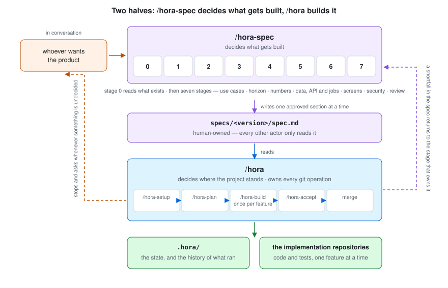
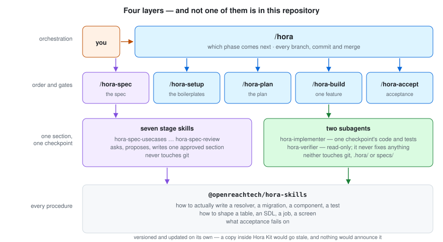
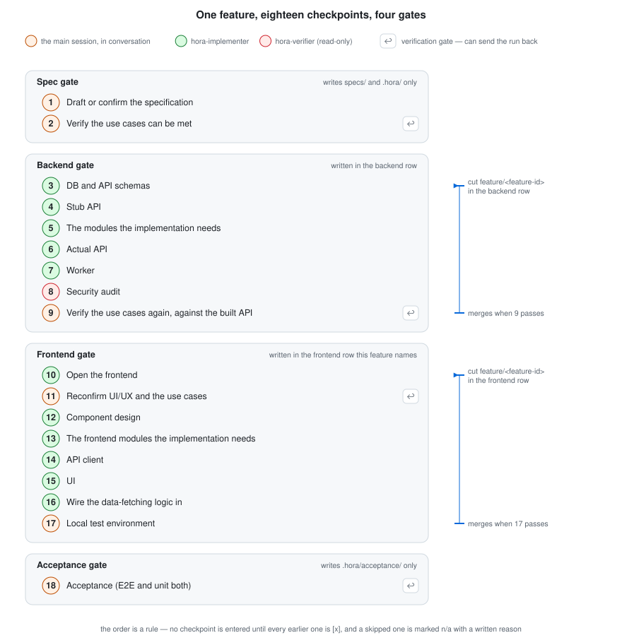
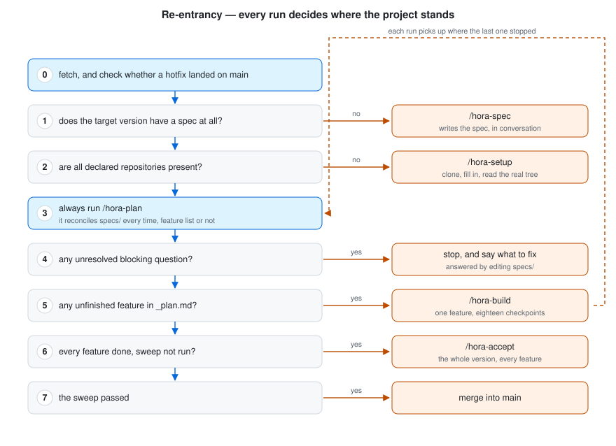
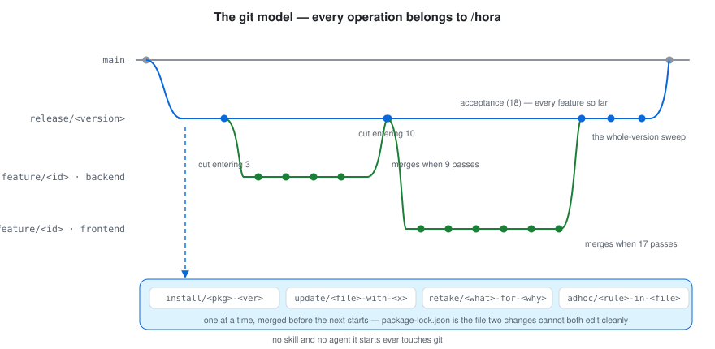
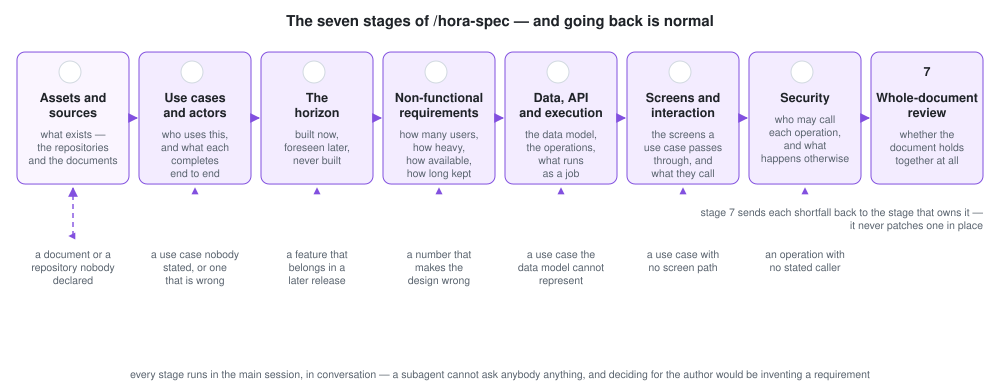
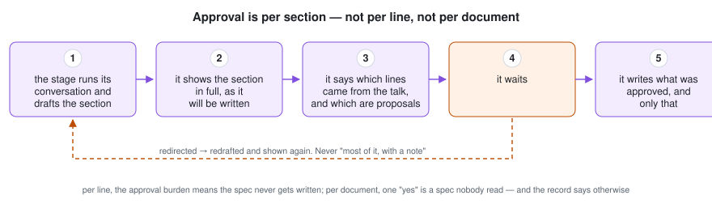

<!-- 日本語版: [architecture.ja.md](./architecture.ja.md) — 片方を直したら、同じコミットでもう片方も直してください -->

# How work gets executed

*[日本語](./architecture.ja.md)*

How Hora Kit turns a spec into an application: what runs where, what holds the state, and why the whole thing is serial.

This document explains the design. It is not the authority on any rule — each rule lives in the skill that owns it, and this file links to it.

---

## Contents

- [Two halves](#two-halves)
- [Part 1 — /hora: building the application](#part-1--hora-building-the-application)
  - [Four layers](#four-layers)
  - [Feature by feature, not layer by layer](#feature-by-feature-not-layer-by-layer)
  - [Where each thing runs, and why](#where-each-thing-runs-and-why)
  - [The state model](#the-state-model)
  - [Re-entrancy](#re-entrancy)
  - [The git model](#the-git-model)
  - [Why it is serial](#why-it-is-serial)
- [Part 2 — /hora-spec: deciding what gets built](#part-2--hora-spec-deciding-what-gets-built)
  - [Reading is not inferring](#reading-is-not-inferring)
  - [Stage 0, then seven stages, in order](#stage-0-then-seven-stages-in-order)
  - [Why every stage is a conversation](#why-every-stage-is-a-conversation)
  - [Approval is per section](#approval-is-per-section)
  - [The state of a spec run](#the-state-of-a-spec-run)
  - [The two boundaries that hold both halves together](#the-two-boundaries-that-hold-both-halves-together)
  - [Where to go next](#where-to-go-next)

---

## Two halves

**Hora Kit is two machines that share one document.** `/hora-spec` decides what gets built, in conversation with whoever wants the product. `/hora` builds what the resulting document says. `specs/<version>/spec.md` is the only thing the two of them share, and that is what lets each half be described on its own.



| | `/hora-spec` | `/hora` |
|---|---|---|
| **what it produces** | `specs/<version>/spec.md` | the implementation repositories, and `.hora/` |
| **its unit of work** | one section of the spec, approved before it is written | one feature, through eighteen checkpoints |
| **what it does with a gap** | asks, proposes, and writes only what was approved | stops, and says what to fix in `specs/` |
| **what it never does** | design anything nobody approved; touch git, `.hora/tasks/` or any repository | invent a requirement; write `specs/` outside one narrow, approved exception |

In time, the spec half comes first. This document takes `/hora` first because most of the machinery is there, and because the spec half is easier to read once it is clear what reads its output.

The two halves also differ in how much of your attention they need, and that is what the recommended way of running them follows. `/hora-spec` is worth sitting through, stage by stage: it is conversation from end to end, and it is where a spec stops being a list of feature names. The implementation half can be left to run — **it stops when it needs an answer instead of deciding**, which is the whole reason unattended is safe here and not in the other half. See [`README.md`](../README.md#recommended-converse-through-the-spec-let-the-implementation-run).

This document is in two parts: Part 1 is `/hora` — the layers, the eighteen checkpoints, the state, re-entrancy, git, and why it is serial. Part 2 is `/hora-spec` — reading what already exists, the seven stages, why every one of them is a conversation, and how approval works.

---

# Part 1 — /hora: building the application

## Four layers



| Layer | What it decides | What it never decides | Ships in |
|---|---|---|---|
| `/hora` | which phase comes next; every branch, commit and merge | anything about the work itself | `@openreachtech/hora` |
| the five skills | the order of the work, and each gate's exit condition | how any of it is written | `@openreachtech/hora`, except `/hora-setup`, which the project's boilerplate ships |
| the stage skills and the two agents | one section of the spec, or one checkpoint's code or verdict | where they run in the order; anything about git | `@openreachtech/hora` |
| the four skills packages | **every procedure and every pass/fail criterion** | when it is invoked | `@openreachtech/hora-skills-ort-core`, `-ort-renchan`, `-ort-furo`, `-ort-support` |

**One skill sits outside all four, and it is the only one `/hora` never starts: `/hora-hotfix`.** It decides neither the order of the work nor a gate's exit condition, because whether something is an emergency is a person's call. It is invoked directly, it works on `main` rather than on a release line, and `/hora` rebases the open release lines onto what it produced. It ships in `@openreachtech/hora` like the rest. See [`commands.md`](./commands.md), `/hora-hotfix`, and [`hotfix.md`](./hotfix.md) for the whole route.

**Not one of the four is in this repository.** All four arrive as packages, and what this repository holds is the spec, these documents, and the run's own record under `.hora/`.

The split between the two packages is the one that surprises people. Hora Kit contains no instructions for writing a resolver, a migration or a component, and it must not — those live in a package that is versioned and updated on its own. A copy inside Hora Kit would disagree with the original the first time that package moved, and nothing would announce that it had. See [`structure.md`](../kit/skills/hora/references/structure.md), "The division of labor", and [`structure.md`](../kit/skills/hora/references/structure.md).

---

## Feature by feature, not layer by layer

One feature goes through its spec, its backend, its frontend and then acceptance. **Only once it has passed acceptance does the next feature start.**



The alternative is worth stating, because it is the ordinary way to do it. Build every backend task, then every frontend task, then test: under that order, the first time anyone finds out whether a feature *works* is after all of them are written — and on a version holding, say, twenty features, a shortfall in the data model is by then twenty features deep, every one of them built on it. That twenty is an example. How many features a version holds differs per project, and the rest of this section reuses the same one.

| | Layer by layer | Feature by feature |
|---|---|---|
| when a design flaw surfaces | at the end, in the test phase | at that feature's own acceptance gate |
| how much is built on top of it by then | everything | nothing |
| what a regression looks like | one of those twenty changes did it | **the change you just made did it** |
| cost | one environment bring-up | one per feature |

The cost is real and it is accepted deliberately: bringing a container stack up per feature is cheap next to unwinding those twenty features built on a wrong table.

The regression net is cumulative, which is what makes the middle row work. At every gate, [`/hora-accept`](../kit/skills/hora-accept/SKILL.md) runs the unit suites across whole repositories — so a feature that breaks an earlier one fails in the run that broke it. The expensive half, driving screens in a real browser, is scoped to the gate's own feature there; every feature is driven end to end once, at the whole-version sweep, or earlier on explicit request.

**Building in this order puts one requirement on the spec, and it is easy to miss: a feature's acceptance criteria have to be meetable at that feature's own gate.** A criterion naming a feature built later cannot be met at any gate that reads it — and four runs act on one anyway, because checkpoint 1 builds from the criteria, 6 and 16 write a test for each of them, and 18 fails the feature and sends the run into somebody else's checkpoint. So acceptance criteria come in two tiers. A feature's own are checked against a product in which that feature and its `depends` are built and nothing later is; a behavior spanning several features goes to the spec's `Version acceptance criteria` section, which no gate reads and the whole-version sweep checks. A criterion in the wrong tier is a `forward-reference` stop at [`/hora-plan`](../kit/skills/hora-plan/SKILL.md), fixed by reordering the features or by moving the behavior up a tier — and the same check catches the other half of it, a written order that contradicts a `depends`.

---

## Where each thing runs, and why

Not everything can be delegated to a subagent, and the line is not about difficulty.

| Checkpoints | Runs in | Why there |
|---|---|---|
| **1, 2, 9, 11** | **the main session, in conversation** | they exist to settle something *with a person*. **A subagent cannot ask anyone anything**, so delegating one turns "settle this with the author" into "the agent decided" — which is inventing a requirement |
| **3–7, 10, 12–16** | `hora-implementer` | ordinary implementation, scoped to one checkpoint's files — or, at 3, 5, 6, 12 and 15, to one unit's, with one agent per table, module, operation, component or screen |
| **8** | `hora-verifier` | a security audit is read-only by design; the agent has no file-editing tools and fixes nothing |
| **17, 18** | the main session | bringing up a container stack, and an acceptance gate whose unit suites span every repository, is not one checkpoint's file-scoped work |
| **the conventions any of them follows** | `hora-digester` | a matched skill runs to thousands of lines and stays resident for every turn its reader takes. This agent reads one skill and writes the digest an implementer reads instead, pinned to the package version it came from |

**Stage 0 and the seven spec stages run in the main session too, for the same reason as 1, 2, 9 and 11** — [Part 2](#why-every-stage-is-a-conversation) holds that, and the one narrow exception to it.

**`hora-verifier` never fixes anything, and that is the point.** Letting the same agent implement and verify opens a path to loosening a failing test until it passes. It has no file-editing tools; it returns the fact that something is failing, and never fixes it.

**`hora-implementer` never touches git, `.hora/`, or `specs/`.** It writes code and tests for one checkpoint — or for one unit of one — and reports everything else: a dependency it needs, a shared file it must not edit, the folder whose aggregation file the main session should regenerate, a contract it wanted to change, a problem it found in the spec. [`/hora-build`](../kit/skills/hora-build/SKILL.md) acts on the report.

**`hora-digester` writes one file and reads everything else.** Its output is `.hora/digests/<skill-name>.md`, and the header names the package it was derived from and that package's version — so a digest is used only while it matches what is installed, and an update of the package it came from leaves each of its digests to be rewritten before any is read again. The skill itself stays the authority: an implementer opens it the moment its digest leaves a question open.

Why the agents are so tightly bounded: every one of those prohibitions removes a way for two writers to collide, or for a decision to be made where nobody can see it.

---

## The state model

There is no state file. **The state is `.hora/`, and its checkboxes are the state.**

```
.hora/
  tree/<repository>.md          what /hora-setup read in the real tree, and the tag it read it at
  digests/<skill-name>.md       one equipped skill's conventions in short form, and the
                                package and version they came from
  spec/<version>/_stages.md     /hora-spec's own record of where it got to (Part 2)
  spec/<version>/_assets.md     what stage 0 read, where from, and at what commit
  spec/<version>/_divergence.md where the documents and the code disagree — one row
                                per divergence, each routed by the stage that owns
                                its subject (Part 2)
  tasks/<version>/
    _plan.md                    the feature order, and the acceptance tasks
    <feature-id>.md             one feature, and its eighteen checkpoints
  contracts/<version>/          one file per server whose consumer is elsewhere
  questions/<version>/open.md   append-only. Answered by editing specs/
  acceptance/<version>/
    <feature-id>.md             every acceptance run for one feature, one
                                appended block each
    _sweep.md                   the whole-version sweep
  glossary.md                   append-only, not split per version

  equip-core.json               what the last hora-core install placed. Gitignored
  hora-skills-ort-core.json     what the last install of each skills package placed —
  hora-skills-ort-furo.json     one record per package. Gitignored
  hora-skills-ort-renchan.json
```

`git log .hora/` is the history of what ran. Nothing else records it, and nothing needs to.

**The two `equip-*.json` files are the exception, and they are gitignored for it.** They record what each package's installer wrote, so the next run can remove exactly that before copying fresh. They are not state of the project and no skill reads them.

### Who may write what

| Directory | Written by | Everyone else |
|---|---|---|
| `specs/` | **humans**, and the two skills that write on their behalf: `/hora-spec`, one approved section at a time, and `/hora-plan`, one approved edit at a time | read-only |
| `.hora/` | the skill whose work it records, and `hora-digester` for the one digest it derives — plus the two package installers, each writing only its own `equip-*.json` | humans read only |
| the implementation repositories | `/hora-setup` as it creates and fills them, `hora-implementer` for one checkpoint's — or one unit's — code and tests, and the main session for every git operation and every aggregation file | — |

**What is protected is not the act of writing — it is that no requirement ever enters `specs/` without a human having read the exact words first.** Both exceptions keep that: approval is per section in `/hora-spec` and per edit in `/hora-plan`, and "yes, do them all" is not approval of anything nobody read. [Part 2](#approval-is-per-section) holds why the granularity is what it is.

### A feature file

```markdown
# #attendance  Recording and listing attendance
<!-- spec: attendance @ sha256:abc123... -->
<!-- repositories: backend, frontend-employee -->

## Spec gate
- [x] 1. Draft or confirm the specification
- [x] 2. Verify the use cases can be met

## Backend gate
- [x] 3. DB and API schemas
- [x] 4. Stub API
- [ ] 5. The modules the implementation needs
...
- [x] 7. Worker  <!-- n/a: this feature triggers no background job -->
```

Three states, and only three: not passed, passed, and not-applicable-with-a-reason. A bare `n/a` is not a state — it is a skipped checkpoint wearing the mark of a cleared one. The full list, with each checkpoint's exit condition, is in [`checkpoints.md`](../kit/skills/hora-build/references/checkpoints.md).

---

## Re-entrancy

**A single session is not expected to finish a project.** Specs are assumed to be plentiful; `/hora` is started and restarted as many times as it takes, and each run decides where it is.



**Step 3 runs even when the feature list already exists.** A spec keeps moving while implementation is under way; sections get added, changed and withdrawn. Reconciling every time is the only way those reach the plan.

### Two different acts, on purpose

| | When | Why |
|---|---|---|
| **writing** a checkpoint's `[x]` | the moment it passes | an interrupted run must resume at the exact checkpoint it stopped at |
| **committing** `.hora/` | once per gate (after 2, 9, 17, 18) | eighteen commits per feature is not a history anyone reads |

Conflating the two costs one of those properties. Keeping them apart costs nothing.

---

## The git model

Every git operation happens in the main session — `/hora` itself, or a skill it runs. No agent any of them starts ever touches git. The rules are in [`commits.md`](../kit/skills/hora/references/commits.md); the shape is this:



**A feature branch is cut per repository, under the same name, and merges at its own gate's boundary.**

| | Cut when | Merges when |
|---|---|---|
| in the backend row | entering checkpoint 3 | **checkpoint 9 passes** |
| in a frontend row | entering checkpoint 10 | **checkpoint 17 passes** |

**Not after acceptance** — acceptance (18) runs suites spanning every feature so far and can fail on any of them, so waiting for it would hold this feature's branches open across other features' work. What acceptance turns up comes back as a `retake/` branch instead, which is already the name for "merged, then found lacking".

**Checkpoint 17 is the one that falls outside the table.** The local end-to-end environment lives in the backend row, whose feature branch merged eight checkpoints earlier — so its changes go on their own `update/e2e-<what>-for-<feature-id>` branch, cut and merged like any other `update/` ([`commits.md`](../kit/skills/hora/references/commits.md)).

Why a dependency gets its own branch: `package-lock.json` is the file two changes cannot both edit cleanly. One change at a time, merged before the next starts, is how a human team avoids that conflict, and it is how this does too.

**A hotfix is the one trunk that does not come from `release/<version>`.** `/hora-hotfix` cuts `hotfix/<hotfix-id>` from `main` and merges it back into `main`, and nothing is ever cut from it — a fix needing a branch of its own is not a hotfix. `/hora` then rebases any open `release/<version>` onto the new `main` ([`commands.md`](./commands.md), `/hora-hotfix`).

---

## Why it is serial

**Two features never run alongside each other, and neither do two checkpoints.** Inside a single checkpoint, its units do — one agent per table, per module, per operation, per component, per screen — and the distance between those two claims is what this section is about.

**Running features or checkpoints in parallel is not an optimization waiting to be switched on. It is blocked on an unsolved problem**, and that problem is written down here because without it, somebody who reads the serial design as an improvement nobody got around to will eventually build parallel execution — and hit the same problem described below. **A design whose "why serial" was never recorded looks, to the next person, like laziness.**

**The problem is git, not throughput.** An implementer agent never touches git, so its work lands uncommitted in one shared working tree alongside whatever else is running. Splitting that back into one clean commit per task afterwards runs into this:

> **An aggregation file is rewritten in full by every task that touches its folder.** By the time an earlier task's commit is built from its own file list, that file already carries every later task's contribution. The commit silently absorbs work that is not its own.

Giving each parallel task its own branch would fix it — except **a single working directory can only have one branch checked out at a time**, and this design does not use git worktrees. The same constraint reappears mid-run: when a dependency is discovered partway through, the serial flow pauses that one task, installs it, and rebases; in parallel, several open branches would each need that rebase, which means switching the whole working directory out from under whatever else is mid-edit.

**Until that is genuinely resolved, serial is not a cautious default — it is the only one that commits correctly.**

The order also makes parallelism worth much less than it sounds. The unit is not a small task; it is a feature that ends at an acceptance run over the whole product. There is not much left to overlap.

**A checkpoint's units clear both halves of that problem, which is why they are the one thing that does run at once** ([`hora-build/SKILL.md`](../kit/skills/hora-build/SKILL.md)). A unit is smaller than a commit: every unit of checkpoint 6 lands in the gate's single commit, so there is no earlier commit for a later unit's work to leak into. And the folder they share is regenerated by the main session once they have all finished, so no unit writes the aggregation file at all. The dependency case keeps its serial answer — a unit that needs one reports it, and `/hora-build` installs it on its own branch before the work continues.

**The saving is in what each agent carries, more than in the wall clock.** One agent writing six resolvers holds a context that grows across all six and pays for the whole of it on every later turn; six agents each hold one. On the measured run, the single heaviest agent was checkpoint 6's, at 308 turns against the largest resident context in the build.

---

# Part 2 — /hora-spec: deciding what gets built

**Leaving `specs/` as human-only territory would make the first step of every project the one step nobody would do twice.** A blank spec plus a format document is a writing assignment, and the format is exacting: use cases and acceptance criteria per feature, the kind of every operation, two different kinds of out-of-scope, an `id` that may never change. Handed that, a person writes the parts they find easy and leaves `/hora-plan` to ask about the rest, one question at a time, for as long as it takes.

**And on a project that already runs, dictation is worse still.** Asked to describe every existing feature — say twenty of them — from memory in that format, a person covers what they remember. The silence around the rest reads exactly like "there is nothing there". **The system is the better witness for what it does, and no witness at all for what anybody wanted.** Stage 0 reads the first kind; the seven stages are still for the second.

**So `/hora-spec` writes it — and every mechanism in this half exists to keep that from becoming "the AI decided the requirements".** [`hora-spec/SKILL.md`](../kit/skills/hora-spec/SKILL.md) is the authority on the skill; [`stages.md`](../kit/skills/hora-spec/references/stages.md) on the stages; [`investigation.md`](../kit/skills/hora-spec/references/investigation.md) on what stage 0 may read; [`asking.md`](../kit/skills/hora/references/asking.md) on how anything is put to a person; [`principles.md`](../kit/skills/hora-spec/references/principles.md) on the thinking they apply.

---

## Reading is not inferring

**The invariant that protects `specs/` forbids inferring a requirement. It has never forbidden reading.** What it protects is that no requirement enters the document without a person having read the exact words — so the middle step is the whole rule:

```
read the code, draft what it shows, show it, let somebody confirm it   allowed
read the code and write the requirement it implies                     forbidden
```

Which is why every reading goes out in one of three forms, and they are never phrased alike:

| | | What the person judges |
|---|---|---|
| **a check** | "I read it as this. Is that right?" | right, or wrong |
| **a proposal** | "I suggest this. It is yours to decide." | take it, or not |
| **a question** | "Nothing decides this. What is it?" | what it is |

The mixing that matters runs one way. A check dressed as a proposal costs a false approval over something that was true anyway. **A proposal dressed as a check puts the kit's own idea into `specs/` as an existing fact** — and nothing downstream can tell it apart from something read off the real system. That is the failure this whole distinction exists to prevent, and it is at its most tempting on an adopted project, where what exists and what is obviously missing turn up in the same breath.

**What no reading ever settles is intent.** Which operations exist is a fact; who they are for, who *should* be allowed to call them, and how much of a feature counts as finished are not in the tree at all. Those are asked, always — with the evidence laid out and nothing recommended.

**The one carve-out is a declaration — written, never inferred.** `Authority: as-built` is a person settling that intent once, in the spec: from there the kit derives `built:` and drafts the use cases off the running system, and puts each up for correction with the drafted value as the default. `to-spec` settles it the other way — completion is never asked, and every checkpoint runs against the code as it stands. Where no declaration is written, the paragraph above applies in full ([`structure.md`](../kit/skills/hora/references/structure.md), invariant 2, "`Authority: as-built`").

---

## Stage 0, then seven stages, in order

**A stage is a gate with one exit condition, exactly like a checkpoint.** Passing it is not "we talked about it" — it is that a stated condition now holds, and that the section it owns is in `specs/<version>/` with somebody's approval on it.

**Stage 0 is numbered 0 because it renumbers nothing.** The seven stages that decide a spec are unchanged; stage 0 gathers what already exists — the repositories, and every document anybody names — so that those seven have something to correct rather than something to compose. On a new project it passes in a sentence.



**No stage may be entered until every earlier one is `[x]`**, because each one's answers are the next one's input, and the alternative costs the work twice:

- A data model designed before the use cases are fixed is designed twice, and the second time there is already a migration written against the first
- A table designed before the user counts are known is designed for the wrong number, and nothing in it says so
- A screen designed before the operations exist invents operations, which then exist only in the screen

**Going back is normal, and it is not a failure.** A stage that turns up something an earlier one got wrong says so, names the stage, and the run returns there. Stage 7 exists to do exactly that, and it never patches a shortfall in place — patching in place is how a document ends up with a use case that no stage ever walked against a data model.

The same table is what brings a build finding back here. A finding at checkpoint 2, 9, 11 or 18 that turns out to be a shortfall in the spec rather than in the code returns to the stage that owns it, instead of being fixed where it was found. Which finding returns where is in [`stages.md`](../kit/skills/hora-spec/references/stages.md), "What sends a run back into a stage" — along with every stage's exit condition and the sub-skill that runs it.

**No stage may write another stage's section.** Stage 4 does not write use cases; stage 1 does not choose a column type. A stage that reaches into the next one's section has decided something before the conversation that was supposed to decide it.

---

## Why every stage is a conversation

**Neither stage 0 nor any of the seven may be delegated to a subagent** — the same line as checkpoints 1, 2, 9 and 11 in Part 1, for the same reason. Every stage exists to settle something with a person, and **a subagent cannot ask anybody anything**; a delegated stage turns "settle this with the author" into "the agent decided", which is inventing a requirement.

**Stage 0's reading and stage 7's mechanical checks are the one exception, and only halfway.** Reading a tree; a missing required section, a duplicate `id`, an operation with no kind, a feature with no acceptance criteria — those are cheap, precise, and could run anywhere. **Their findings still come back to the main session to be settled**, and running them first is worth it: what remains needs somebody to read the document as a whole, and it is better to arrive there with the cheap findings already cleared.

**Reading more does not make a stage less of a conversation — it makes it a better one.** A stage with no evidence asks a person to compose; a stage that has read the system asks them to correct, and offers the likely answer as a choice. **The number of questions does not go down.** What goes down is the cost of each one, which is the only part worth optimizing: people who get asked start writing it down in advance, and the asking is what trains whoever writes the spec.

---

## Approval is per section



| Granularity | Why not |
|---|---|
| per line | the number of approvals one section takes is a burden nobody carries twice, and a spec that never gets written is the result |
| **per section** | **what this skill uses.** A section is the smallest unit that means anything on its own |
| per document | a whole spec approved with one "yes" is a spec nobody read. That is worse than no approval, because the record says otherwise |

**Invariant 2 was never "a human must type it".** It is that no requirement enters `specs/` without a human having read the exact words. Typing was never the protection; reading is — and a person made to type a section themselves read it no more carefully.

### What may be written, and what may only be proposed

| What it is | What happens to it |
|---|---|
| a requirement, a constraint or a decision **stated in the conversation** | **written into `specs/`.** That is the skill's entire job |
| an improvement, an alternative or a gap **the skill thought of** | **proposed, marked as a proposal.** It becomes spec text only once the person says yes |
| a requirement **nobody stated and nobody approved** | **never written.** That is inventing what the spec does not say |

**Proposing is required, not merely allowed.** Whoever asks for a product describes the product they already have in mind, and the gaps in it are invisible from the inside. Breaking a request down, offering a better shape for a flow, and naming the case nobody thought of is the value of this half. What is forbidden is the proposal that goes in silently — so a proposal is labelled a proposal, every time, and an assumption a stage made in order to keep moving is stated in the same breath.

---

## The state of a spec run

Same model as Part 1, one directory over. `/hora-spec` records where it got to in `.hora/spec/<version>/_stages.md`; there is no separate state file, the checkboxes are the state, and `git log .hora/` is the history.

```markdown
1. [x] Use cases and actors
2. [x] The horizon
...
5. [x] Screens and interaction  <!-- n/a: this version declares no frontend -->
```

Three states, and only three — not passed, passed, and not-applicable-with-a-written-reason, exactly as in a feature file. The reason is checked against that stage's own "not applicable when" line, never against "the requester did not want to talk about it".

**Only stage 5 has such a line at all** — a version that declares no frontend repository, an API-only release for a phone app, say. Every other stage is passed. A release with no authentication still has to say so at stage 6, and why; a version with no backend row still has to declare that at stage 4.

**From the second version on, a stage may pass by carrying over, and that is still one of the three.** `spec.md` is a diff from there on, so most of what the seven stages settle was settled a release ago; a stage whose section this version does not touch states the previous version's answer, gets it confirmed, and passes with the carry-over written next to it — `<!-- carried: 1.0.0's numbers, confirmed unchanged -->`. **It is a check, never an assumption**, because a carry-over is the one kind of pass that is indistinguishable from a stage that did not run. **Stages 6 and 7 never carry over for anything a version adds**, which is what lets the rest be brief. Which stages may is per stage in [`stages.md`](../kit/skills/hora-spec/references/stages.md).

---

## The two boundaries that hold both halves together

Everything above rests on two lines. Both are stated in [`structure.md`](../kit/skills/hora/references/structure.md).

### 1. Ownership is split

`specs/` is human-owned; `.hora/` is written by the kit. When something is wrong in `specs/`, the response is to ask — a typo and a broken layout are treated the same. Allow "it is minor, I will just fix it" once and the rule is gone. The two writing exceptions in Part 1's table are not a softening of this: both write only words a person has just read and approved.

### 2. Classifying may be inferred; content may not

| | Example | Treatment |
|---|---|---|
| classifying | `target`, `depends` | **may be inferred** — it attaches a label, it adds no information |
| content | requirements, use cases, acceptance criteria, **which kind an API operation is**, **how far a feature was already built** | **must not be inferred** — it would mean inventing what the spec does not say |
| a permanent identifier | `id` | **must not be invented** — it is the reference key from `.hora/tasks/`, and it never changes |

**"Do not try to keep the number of questions down."** People who get asked start writing it down in advance, which is the mechanism that improves the spec.

---

## Where to go next

| | |
|---|---|
| what a project built with the kit contains, and how to start one | [`hora-boilerplate`](https://github.com/openreachtech/hora-boilerplate) |
| what each command does, step by step | [`commands.md`](./commands.md) |
| the emergency route, end to end | [`hotfix.md`](./hotfix.md) |
| the skills the checkpoints delegate to | [`structure.md`](../kit/skills/hora/references/structure.md) |
| putting this on a project that already exists | [`adopting.md`](./adopting.md) |
| the eighteen checkpoints themselves | [`checkpoints.md`](../kit/skills/hora-build/references/checkpoints.md) |
| stage 0, then the seven stages a spec is written through | [`stages.md`](../kit/skills/hora-spec/references/stages.md) |
| what stage 0 may read, and what no reading settles | [`investigation.md`](../kit/skills/hora-spec/references/investigation.md) |
| a check, a proposal or a question | [`asking.md`](../kit/skills/hora/references/asking.md) |
| the thinking a spec is written with | [`principles.md`](../kit/skills/hora-spec/references/principles.md) |
| the format of a spec | [`spec-format.md`](../kit/skills/hora/references/spec-format.md) |

<!-- The figures in ./images/ are generated in pairs — x.svg and x.ja.svg. Edit one and edit the other. -->
