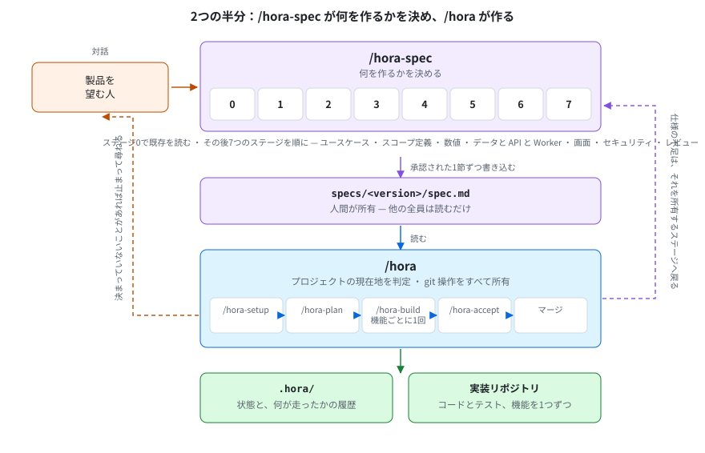
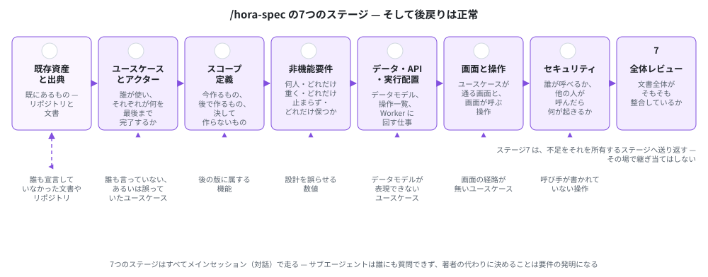
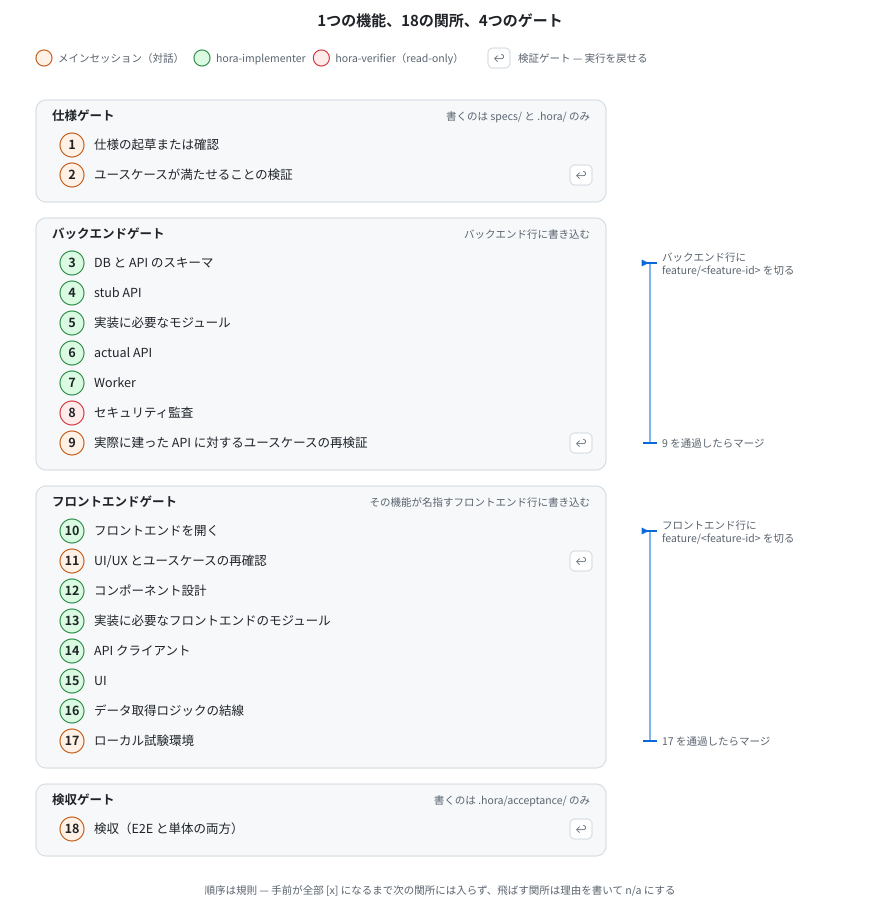

<!-- English: [commands.md](./commands.md) — 片方を直したら、同じコミットでもう片方も直してください -->

# 各コマンドが何をしているか

*[English](./commands.md)*

主要な6つのコマンドを、毎回同じ5項目で説明します：何をするか / 何を読むか / 何を書くか / いつ止まるか / 単独で叩きたいとき。このほかに直接叩けるものとして、`/hora-hotfix`（緊急経路。後述）と、`/hora-spec` が走らせる7つのステージ skill（`/hora-spec` の節に名前があります）があります。

**通常の利用では `/hora` しか打ちません。** どれを走らせるかは `/hora` が決めます。**唯一 `/hora` が起動しないのが `/hora-hotfix`** です — 緊急かどうかは人が決めます。残りを記載しているのは、直接呼びたい場面があるためです — 検収をやり直したい、仕様変更後に計画だけ見たい、途中で終わったセットアップを直したい、など。

**このうち2つは人が付いていてほしく、残りは走らせておけます。** `/hora-spec` は最初から最後まで対話で、`/hora-plan` は仕様が未決のまま残した所を尋ねます。`/hora-setup` / `/hora-build` / `/hora-accept` に見張りは要りません — **決めずに止まって尋ねる**ので、放っておいても安全です。推奨と、「自動執行」が意味すること・意味しないことは [`README.ja.md`](../README.ja.md) の「推奨：仕様は対話で、実装は自動執行で」にあります。

すべてのコマンドは **hora リポジトリのルート**（`<myproject>-app`）で動きます。

---

## 目次

- [/hora](#hora)
- [/hora-spec](#hora-spec)
- [/hora-setup](#hora-setup)
- [/hora-plan](#hora-plan)
- [/hora-build](#hora-build)
- [/hora-accept](#hora-accept)
- [/hora-hotfix](#hora-hotfix)
- [実際のセッションの見え方](#実際のセッションの見え方)
- [次に読むもの](#次に読むもの)

---

## `/hora`



**オーケストレーター。** プロジェクトの現在地を割り出し、次に来る skill を走らせ、git 操作をすべて所有します。

| | |
|---|---|
| **読む** | `specs/`、`.hora/`、宣言された全リポジトリの `git` 状態 |
| **書く** | 直接は何も。ただし**全リポジトリのブランチ・コミット・マージはすべてこのコマンドのもの** |
| **止まる条件** | 実装スキルが1つも装備されていない（後述）。blocking な質問が未解決。自分で決めてはいけない判断が必要。hotfix 追従で自力解決できないものに当たった |
| **直接叩く場面** | 常に。これが通常の入口です |

### 毎回、最初にやること

```
   .claude/skills/ に hb- / hf- / hc- の名前を持つスキルはあるか
                                           無ければ → 止まり、実装スキルの
                                                      装備を求める
0. どこでも git fetch origin --prune。そして hotfix が main に入ったか確認
1. その版に仕様書はあるか                  無ければ → /hora-spec
2. 宣言されたリポジトリは全部あるか        無ければ → /hora-setup
3. 常に /hora-plan を走らせる
4. 未解決の blocking な質問はあるか        あれば → 止まり、何を直すか伝える
5. _plan.md に未完了の機能はあるか         あれば → 準備できた最初の1つに /hora-build
6. 全機能が終わり、_sweep.md の最新ブロックが reach: full の合格でない
                                           → /hora-accept（版全体）
7. 最新ブロックが reach: full の合格        → main へ merge
```

作業開始前に判断を1行で報告します：*「continuing 1.0.0. 4 of 11 features done, building #payroll from checkpoint 6.」*

**手順0は hotfix 検知も兼ねています。** `/hora` にスケジューラは無いので、この fetch と、`release/<version>` への各マージ直後の確認だけが、`origin/main` が動いたことに気づく経路です。

### 決してしないこと

- **スコープを決める。** 版が進めなくなったときは選択肢（作る／落とす／繰り延べる／切り出す）を並べて待ちます
- **`specs/` を書く。** 書けるのは `/hora-spec`（1節ずつ）と `/hora-plan`（1編集ずつ）だけで、どちらも書き込む文面そのものをあなたが承認してからです
- **手動検証を代行する。** 好きなときにご自身でどうぞ — コマンドは `/hora-setup` が `.hora/tree/<repository>.md` に記録したものです

---

## `/hora-spec`



**仕様書を書く SKILL。** 既にあるものを読んだ上で、版の仕様書をあなたと対話しながら書き、実作業を行う7つのステージ SKILL を順に呼びます。

| | |
|---|---|
| **読む** | `specs/`、`.hora/spec/`、**既存リポジトリと、あなたが指し示した文書**、そしてあなたが話したこと |
| **書く** | `specs/<version>/spec.md` と、その版の機能ファイル — **1節ずつ、書き込む前に全文を提示し、承認されてから書き込みます。** ほかに `.hora/spec/<version>/_stages.md`、`_assets.md`、`.hora/questions/` |
| **止まる条件** | 答えられる人がその場にいないとき。その場にいない誰かの判断が必要になったとき |
| **直接叩く場面** | 新しい版の仕様書を書き始めるとき。書きかけの仕様書を続けるとき。計画には触れず設計判断だけ変えたいとき |

### ステージ0と、7つのステージ

```
0. 既存資産と出典              既にあるもの — リポジトリと、誰かが挙げた文書すべて。
                               新規プロジェクトなら一文で終わる
1. 想定ユースケースとアクター  誰が使い、それぞれ何を最後まで完了するのか
2. スコープ定義                この版が載せるもの、後回しにして余地だけ残すもの、
                               永久に作らないもの
3. 非機能要件                  現在と将来のユーザー数、最も重い処理、可用性、
                               保持期間、必要なミドルウェア
4. データ・API・実行場所       リポジトリとサーバー、テーブル、操作とその種別、
                               Worker として動かすもの
5. 画面とインタラクション      各ユースケースが通る画面と、各画面が呼ぶ操作
6. セキュリティ                各操作を誰が呼べるのか、他の誰かが呼んだらどうなるのか
7. 全体レビュー                全体が整合しているか、全ユースケースが実現可能か
```

**ステージ1〜7はそれぞれが独立した skill で、単独でも叩けます**：`/hora-spec-usecases`、`/hora-spec-horizon`、`/hora-spec-nonfunctional`、`/hora-spec-backend`、`/hora-spec-frontend`、`/hora-spec-security`、`/hora-spec-review`。`/hora-spec` はこれらを順に走らせます。そのステージの対話だけやり直したいときに単独で叩いてください。ステージ0 だけは専用 skill を持たず、`/hora-spec` 自身が実行します。

**順序は規則であり、各ステージは関所です。** ユースケースが固まる前に作った DB 設計は2回作ることになり、ユーザー数を知る前に設計したテーブルは間違った規模向けに設計されます。各ステージの通過条件は [`stages.md`](../kit/skills/hora-spec/references/stages.md) にあります。

**後戻りは正常です。** ステージ7は、見つかった不足をそれを所有するステージへ戻すために存在します。チェックポイント2 / 9 / 11 / 18 が「コードではなく仕様の不足」を見つけたときも、同じ表に従ってここへ戻ります。

**ステージ0 が、動いている製品を口述させずに済ませる仕組みです。** リポジトリと文書を読み、そこに現れているものを草案に起こし、あなたが訂正できる形で返します。読むものが何も無いプロジェクトでは、その旨を記録して次へ進みます（[`investigation.md`](../kit/skills/hora-spec/references/investigation.md)）。

コードのあるプロジェクトでは、1つの宣言がこの対話の量を決めます：`Authority:` — `as-built`（今動いているものがこの版。質問は数個に減り、ユースケースはシステムから草案されてあなたが訂正する）か `to-spec`（仕様が正。コードが関所を通って追いつく）か。ステージ1で1回だけ尋ねられ、機能ごとに上書きでき、必須です — 手順の全体は [`adopting.ja.md`](./adopting.ja.md) の「最初に、2つの適用のどちらかを決める」にあります。

### 出した版に機能を足すとき

**2版目からの `spec.md` は、直前の版に対する差分です** — この版が変える節だけを書きます。それ以外は「書かないこと」によって引き継がれ、過去の版は決して書き換えません（[`spec-format.md`](../kit/skills/hora/references/spec-format.md)）。**空のスケルトンは差分の版にはコピーしません**。機能を1つ足すだけの文書に、空の見出しが20個並ぶことになるからです。

**書くのは文書ではなく、概要で構いません。** 欲しいものを `specs/<version>/request/` に置いてください — メール、チケット、箇条書き1ページ、欲しいと言った本人の言葉のままで結構です。そして `/hora-spec` を実行します。ステージ0 がそれを最初に読み、**この版の議題**として扱い、7つのステージが節に起こします。各節は、書き込む前に全文を提示して承認を得ます。

```
specs/1.1.0/
  request/
    csv-export.md    「管理者が1か月分の勤怠を CSV で欲しい」
  spec.md            ← /hora-spec がそこから書くもの。差分なので、
                       文書情報と CSV エクスポート機能だけ。他は無し
```

| | `sources/` | `annex/` | `request/` |
|---|---|---|---|
| そこに置くことが意味するもの | **これは仕様である** | **これは仕様を説明する** | **これが欲しい。仕様に起こしてほしい** |
| 表に宣言され、`spec.md` からリンクされる | する | する | **決してしない** |
| `/hora-plan` がタスクを抽出する | する | しない | **そもそも読まない** |

**リクエストは、ソースのように「その通りである」ことを求められません。** 自己矛盾していても、両立しない2つを求めていても、誰が開く画面か書いていなくても構いません — その一つ一つは質問になるのであって、あなたのファイルの欠陥にはなりません。粗いメモをそのまま渡せることが、このディレクトリの存在理由そのものです。 同じことを会話で話しても動作は同じで、ディレクトリがあるのは、リクエストがメッセージより長いことが多く、その場にいない誰かが書いたものであることが多いからです。

**ステージは、既に出したものへの同意を取り直しません。** この版が触らない節を持つステージは**引き継ぎ**として通過します — 直前の版の答えを、そこで確定した言葉のまま提示し、確認を取ります。**推測ではなく確認**であり、終了報告は引き継いだステージを1つずつ名指しします。引き継ぎは、走らなかった場合と見分けのつかない唯一の通過だからです。

**2つのステージだけは決して引き継ぎません。そしてそれが、他を短く済ませてよい理由です。** ステージ6 は、この版が足す全操作の呼び出し元と拒否のされ方を、足した版で明記します。ステージ7 は差分ではなく**解決後の文書**をレビューします — 1.0.0 が書いた規則と矛盾する新操作は、2ページの差分の中では見えず、全体の中でははっきり見えるからです。どのステージが引き継げるかは [`stages.md`](../kit/skills/hora-spec/references/stages.md) にステージごとに書かれています。

### 尋ね方 — 確認・提案・質問

この3つは別のもので、同じ言い回しで出されることはありません（[`asking.md`](../kit/skills/hora/references/asking.md)）。

| | 意味 | あなたが決めること |
|---|---|---|
| **確認** | 「こう読み取りました。合っていますか」 | 合っているか、違うか |
| **提案** | 「こうしてはどうでしょうか。決めるのはあなたです」 | 採るか、採らないか |
| **質問** | 「これは何も決めていません。どうしますか」 | それが何であるか |

**是とされた確認は「事実」として、承認された提案は「あなたの決定」として入ります。** 混同は片方向にとくに効きます — 提案を確認の口調で出せば、キット自身の思いつきが「システムが既にそうなっているもの」として仕様書に入り、後から両者を区別する手立てがありません。

**回答は可能な限り選択肢として提示されます。** 書き起こすのではなく直す形になり、「その他」は常に選べます。選択肢に畳まれないのは節の承認だけで、そこだけは正確な文言を読む必要があります。

### 書き方

**提案はしますが、決めるのはあなたです。** SKILL 自身が考えたもの — 誰も挙げなかったユースケース、もっと短い動線、実は2つに分かれるロール — は「提案」として提示され、あなたが承諾するまでファイルには入りません。

```
hora  ステージ1。「勤怠管理、承認、給与」と伺いました。
      「誰が何を完了するか」に分解すると：

        - 従業員が出勤時に打刻し、その日の勤務時間が一覧に出る
        - 管理者が1か月分をまとめて承認し、集計が確定する
        ...

      あなたの発言には無かった提案が2つあります：

        - 打刻を忘れた従業員が翌日に前日分を申請する。
          4つのユースケースのどれも「間違いの訂正」を扱っていません。
        - 初回起動：従業員も記録も無く、まだ誰も何も設定していない状態。

      どちらか追加しますか？
```

**承認は「1節ごと」で、文書まるごとではありません。** 仕様書全体に対する1回の「はい」は、承認が無いよりも悪くなります — 記録の上では「読んだ」ことになるからです。理由は [`structure.md`](../kit/skills/hora/references/structure.md) の不変条件1にあります。

### 決してしないこと

- **要件を発明する。** 黙って入り込む提案がまさにそれです
- **読んだものを、そのまま要件にする。** 読むことはステージ0の仕事ですが、読み取りは確認として提示され、あなたが是としたものだけが書かれます
- **機能がどこまで作られているかを結論する。** 見つけたものを並べるだけで、何も推奨しません — 半端な画面と完成した画面は、ファイル一覧の上では見分けがつきません
- **スコープを決める。** 詰め込みすぎだと言い、絞り込み案を出し、答えを記録するところまでです
- **計画、clone、コード、git。** 書くのは仕様書だけです

---

## `/hora-setup`

**コードセットアップ。** 仕様書が宣言したリポジトリを作り、案件の値を埋め、届いた実物のツリーを読みます。

**この1つだけは Hora Kit にありません。** やることが最初から最後までひとつのスタックの話 — どのリポジトリが要るか、何がそれを満たすか、届いた後に何を読むか — なので、そのスタックを知る boilerplate が書き、そこから配置します。`/hora` は他の4つと同じように呼びますが、配置されていなければ手順2の手前で止まります。

| | |
|---|---|
| **読む** | 仕様書のリポジトリ構成とプロジェクト名。各リポジトリの実物のツリー |
| **書く** | 実装リポジトリ。このリポジトリの `package.json` / `.gitignore` / `eslint.config.js`。`.hora/tree/` |
| **止まる条件** | リポジトリ構成節が無い。プロジェクト名が無い。backend が0個または2個以上。サーバー表が無い。宣言された `Directory` の先が存在しない |
| **直接叩く場面** | 後の版でリポジトリ行を足したとき。初回が途中で失敗したとき |

### 何をするか

```
1. 宣言に対して足りないものだけを作る       （冪等）
2. 案件名を持つ値を埋める
3. clone した中身を実地に読み、.hora/tree/ に記録する
4. 作った行にテストキャッシュを敷く         （扱うスキルがあるときだけ）
```

**版ごとに再評価します。** リポジトリは後から増えます（スマホアプリ向け API で始まり、後から管理画面が付く）。一度通れば終わり、ではありません。

**スキルの配備は、もうここの手順ではありません。** このリポジトリの `postinstall` を通して `npm install` が配置します（[`structure.md`](../kit/skills/hora/references/structure.md)）。`/hora-setup` にできることは無く、途中で失敗した実行が配備を積み残すこともありません。配り直したいときは `npm run hora:init` です。

**手順3は何も焼き込みません。** 常に最新タグを clone するので、Hora Kit に書き込んだ規約はいずれ実物と食い違います。読んだ内容は読んだ時点のタグとともに `.hora/tree/<repository>.md` に控え、タグが変わったら読み直します。**食い違ったときは実物が勝ちます。**

**手順4は、配備されたスキルがテストキャッシュを扱っているときだけ走り、渡すのは検証単位の一覧だけです** — 作った行につき1つ、テストコマンドは既に記録済みのものです。キャッシュ宣言がどういう形をしているかはそのスキルのものであって、このコマンドのものではありません。敷いたのか、扱うスキルが無くて飛ばしたのかは、行ごとに `.hora/tree/<repository>.md` が書きます。

### 決してしないこと

boilerplate の同梱（vendoring）、upstream remote の保持、submodule 化、`npm update`、ミドルウェアの起動、**人が既に埋めた値の上書き**。

---

## `/hora-plan`

**プランナー。** どの版を作るかを確定し、その仕様書を「実際に作れる状態」まで持っていき、機能一覧を書きます。

| | |
|---|---|
| **読む** | `specs/` 配下の全版ディレクトリ（差分として解決）、`.hora/tasks/`、`.hora/questions/` |
| **書く** | `.hora/tasks/<version>/_plan.md` と機能ごとのファイル。`.hora/contracts/`。`.hora/questions/`。`.hora/glossary.md`。**そして `specs/` を、承認済みの1編集ずつ — ただし1行で済む穴だけ。設計判断が必要なものは `/hora-spec` に戻します** |
| **止まる条件** | その場にいる人が答えられない blocking な質問が出たとき |
| **直接叩く場面** | `specs/` を編集した後、実装を始めずに「何が変わり、何が無効になるか」だけ見たいとき |

### 何をするか

```
1. 実装する版を確定する
2. 仕様書の抜け漏れ・矛盾を検証し、対話で解決する
3. サーバーごとに contract を導出する
4. 用語集を書く
5. 計画と、機能ごとのファイルを書く
6. 再入時は specs/ と既存を突き合わせる
```

### どの版か、そして新しい版にしてよいか

**手順1が、新しい版番号を判定する場所です。境界は変更の大きさではなく、その版がリリース済みかどうかです。** 判定材料は hora リポジトリのタグで、`release.yml` が main へのマージ時に作ります。

```bash
git fetch --tags && git tag -l '1.0.0'    # 空 = 未リリース
```

| | 扱い |
|---|---|
| **未リリース** | 追加も変更も削除も受け付け、**版番号は変わりません。** 利用者がいないので、契約を変えても誰も壊れません。起きるのは手戻りであって、互換性の破壊ではありません。リリース直前の仕様変更は、まったく正常です |
| **リリース済み** | 手を触れません。次の版で行い、その番号は下の表から決まります |

**2版目からの番号は、感覚ではなく `.hora/contracts/` の差分に対して判定します。**

| contract の差 | 妥当な上げ方 |
|---|---|
| 無し | patch（何も追加されていない場合） |
| フィールドや型が**追加だけ** | minor |
| 削除・改名・型変更・**必須フィールドの追加** | **major** |

contract に現れない変更（文言の修正、内部リファクタ）は patch。どの contract にも現れないがユーザーに見えるもの — 新しい画面など — は minor です。**版番号はディレクトリ名3つとタグになるので、ここに不明点があれば `blocking: yes` です。** 版の飛びは報告のみ、逆行と重複は blocking。

**そのうえで版を差分として解決します。** 昇順に並べ、順に上書きし、キーは `id`、**それぞれが「直前の版」に対する差分**です（最下位に対してではありません）。以降の処理は、ダイジェストも「消えた節」の判定も、すべて解決後の文書に対して行われます。

### 対話する部分

質問するのはこのコマンドです。 解決済みの仕様書を通しで見て、とくに以下を確認します。

| 欠けているもの | 困る理由 |
|---|---|
| **想定ユースケース**（機能ごと） | 関所2・9・11 に照合対象が無い |
| **受入基準**（機能ごと） | 「何をもって完了か」を発明することになる |
| **各 API 操作の種類** — query / mutation / subscription / REST | 関所3・6・14 がどの規約に従うか選べない |
| 実装スコープ（「今は対象外」と「恒久的に対象外」の別） | 拡張点と使われない抽象を区別できない |
| **版そのものの受入基準** — 無ければ `none` | 版全体のスイープが、製品を照合する相手を持たない |
| **後から作る機能に届いてしまっている基準**、および `depends` と矛盾する順序 | 4つの実行がそれに対して動く — 関所1が読んで作り、6と16がテストを書き、18が落とす |

見つけるたびに、**内容を述べ、正確な編集案を提示し、あなたがその編集を承認するのを待ってから書きます。** 承認は1編集ごとです。その場で答えられないものは `.hora/questions/<version>/open.md` に書き出され、後で `specs/` を編集して答えます。

**想定ユースケースと受入基準は別物です。** 基準だけあってユースケースが無い機能は、「個々には正しく、合わせると到達不能な操作の集合」を生みます — どの API も正しい値を返し、どの画面もそれを人にできることに繋げていない状態です。この失敗は放っておくと18関所の一番奥、検収で出てきます。

**受入基準は二段になっていて、その分割が機能の関所を達成可能に保ちます。** 機能ごとの基準は、その機能とその `depends` までが作られていて、それより後は何も無い製品に対して、関所18で確認されます — だから先行機能に乗るのは構わず、後から作る機能を名指すことはできません。**複数機能を跨ぐ振る舞いは、仕様書の `Version acceptance criteria` 節へ行きます** — どの関所も読まず、版全体のスイープだけが確認する節です。段を間違えた基準は `forward-reference` として止まり、`/hora-spec` のステージ2で「順序を直す」か「段を上げる」かで直します。計画側が黙って順序を入れ替えて合わせることはしません。

### 書かれる計画

**機能単位であって、実装単位ではありません。** *「勤怠機能を作る」*は項目になりますが、*「RpaFlow モデルを書く」*はなりません — それは関所であり、プランナーが決めることではありません。

```markdown
## Features
1. [ ] #attendance            backend, frontend-employee
2. [ ] #attendance--monthly   backend, frontend-employee   depends: attendance
3. [ ] #payroll               backend, frontend-admin      depends: attendance--monthly

## Acceptance
- [ ] Sweep the whole version, once every feature above is done
      Version criteria: 4 (#version-acceptance-1-0-0), 1 resting on #billing
```

スイープの項目は版そのものの受入基準を携えます — 本数、節の `id`、そして誰も受け入れていない機能に乗っている本数。毎回の実行で導出し直されます。

### 再入時

**`/hora` が走るたびに走り**、突き合わせます。計画確定後に `specs/` へ足された節は、ここだけが計画に届ける経路です。ダイジェストが変わった節は関所が解除されます — **どこまで戻すかは何が変わったかによります**：ユースケースなら関所2から、API の形なら3から、受入基準だけなら18から、**版そのものの受入基準ならスイープの項目だけで、どの機能の18にも触りません** — どの関所も読んでいないので、どの機能の合格も古びていないからです。判別できないときは2から解除します。必要以上に作り直すコストは時間ですが、もう満たしていない仕様に対して「通過済み」を残すコストは正しさだからです。

---

## `/hora-build`



**1機能を、18の関所に、順番に通す。**

| | |
|---|---|
| **読む** | `_plan.md`、その機能のファイル、contract、用語集、`.hora/tree/` |
| **書く** | 実装リポジトリのコードとテスト（エージェント経由）。その機能の関所チェックボックス。質問 |
| **止まる条件** | 関所の終了条件を満たせない。コード変更では直せない理由でテストが落ちた。準備できた機能が無いのに未完了が残っている（依存の循環） |
| **直接叩く場面** | `/hora` の全体判定を挟まずに特定の機能を進めたいとき |

### 何をするか

```
1. [ ] で、依存が満たされている最初の機能を取る
2. [ ] の最初の関所を取る
3. 走らせ、終了条件を検め、[x] を書く
4. 繰り返す。.hora/ はゲート境界でコミットする
```

開始前に1行で報告します：*「building #attendance, from checkpoint 6 of 18.」*

### 18の関所、4つのゲート

| ゲート | 関所 | 書き込む先 | マージ時点 |
|---|---|---|---|
| **仕様** | 1 仕様策定・確認 · 2 ユースケース検証 | 無し | — |
| **バックエンド** | 3 DB/API スキーマ · 4 stub API · 5 モジュール · 6 actual API · 7 worker · 8 セキュリティ監査 · 9 ユースケース再検証 | backend 行 | 9 の後 |
| **フロントエンド** | 10 フロント着手 · 11 UI/UX とユースケース · 12 コンポーネント設計 · 13 フロントのモジュール · 14 API クライアント · 15 UI · 16 データ取得の組み込み · 17 ローカルテスト環境 | frontend 行 | 17 の後 |
| **検収** | 18 検収 | 無し | — |

各関所の終了条件・委譲先スキル・n/a 条件は [`checkpoints.md`](../kit/skills/hora-build/references/checkpoints.md) にあります。

順序について、意図して決めた点が3つあります。

- **4（stub）がフロントエンドゲートより前**にあるので、12–14 は 6 を待たずに「形の正しいもの」に対してクライアントと画面を作れます。16 で actual API に差し替えますが、stub と実装はクラス名と interface を共有しているので、これは書き直しではなくエンドポイントの切り替えです
- **5 と 13 は、次の関所が import するモジュールを先に揃えます。** 5 はその前に社内パッケージのカタログ（`@openreachtech/hora-ecosystem`、このリポジトリ自身の devDependency）を確認し、会社が既に出しているものの再発明を防ぎます。実装の途中で「持っていない外部クライアントが要る」と判明する中断こそ、この関所が消すために存在します
- **2・9・11・18 はユースケースに照合します。** 3回下見をして1回本番、ではありません。落ち方が違います：2 は仕様が支えているか、9 は API が支えているか、11 は画面が支えているか、18 は製品が支えているか

### 後戻りは正常

検証ゲートが落ちると、無効になった関所を解除し、解除した最も手前まで戻ります。**一度も戻らない実行は、仕様書が異常に完璧か、検証ゲートが仕事をしていないかのどちらかです。**

---

## `/hora-accept`

**検収 — ユニットスイートは毎回フル、レビューは起動形態に応じた範囲で。** 機能の関所（18）ではその機能自身をレビューし、実ブラウザでのライブ掃引は明示的に要求されない限りスキップします。版全体のスイープでは実装済みの全機能をレビューし、必ず製品を駆動します。

| | |
|---|---|
| **読む** | `.hora/tasks/`（対象範囲の算出）、動いているアプリケーション、テストスイート |
| **書く** | `.hora/acceptance/<version>/<feature-id>.md`、版全体なら `_sweep.md` |
| **止まる条件** | 製品を駆動する実行で、ローカルの E2E 環境が無い・不完全なとき。**本当は動いていないものをレビューする代わりに** `lacked-environment` を報告します |
| **直接叩く場面** | 何かを直した後に検収し直したいとき。今この製品が何をできるのかの現況を取りたいとき |

### 何をするか

```
1. 環境の確認        ローカル E2E コンテナ環境 — ライブ実行のときだけ
2. ユニットスイート   テスト配置と、スイートを緑にすること（リポジトリごと）— 毎回必須
3. シナリオ一覧      E2E テスト仕様
4. 受入レビュー本体   レビュー本体と、その判定基準を、この実行の範囲で
5. UX の指摘         UI/UX 監査 — スイープ、または明示的な要求時
```

**各手順が名指しするのは作業であって、スキルではありません。** hora のファイルはパッケージのスキル名を書き留めません — 突き合わせは実行時に、配備されたスキル自身の description に対して行われ、マッチした名前はその実行の記録に入ります。理由は [`structure.md`](../kit/skills/hora/references/structure.md) にあります。

**このコマンドは判定基準を1つも持っていません。** レビューが何を見て何で落とすかは委譲先のスキルにあり、このコマンドが決めるのは「対象機能」「委譲の順序」「結果の記録先」だけです。

**版そのものの受入基準はスイープのものであり、どの関所実行も読みません** — 人が範囲を広げた実行でも同じです。複数機能を跨ぐ基準なので、関所で判定すればそのうち1機能しか持たない製品に対して落ちてしまいます。記録は必ずどちらだったかを書きます：スイープなら `version-criteria: 4 of 4`、関所なら `not in scope (gate)`、版が `none` を宣言していれば `none declared`。**版が宣言した本数より少なく確認したスイープは合格ではなく**、その版は完了になりません。

**手順1は準備運動ではなく関門です。** レビューは各ロールでサインインし、フローを成功条件まで完了させ、依存を意図的に止めて画面が何と言うかを見ます。フロントエンドを単体で立てただけの相手には、そのどれも意味を持ちません。そのやり方で走らせたレビューは、**得ていない合格を報告します。**

**手順2をレビューより前に置くのは意図的です。** ユニットスイートは安く、落ち方が正確です。同じ欠陥を E2E フロー越しに見つけると、位置の特定にはるかに費用がかかります。

**リポジトリ自身のテストコマンドが、入力が変わっていない実行の結果を再利用することがあります。関所実行はその上に立って構いません** — それは2回目の実行を飛ばしただけで、テストを飛ばしたのではありません。どの手順が再利用し、その裏付けが何だったかは記録が書きます。**版全体のスイープは実測で走ります** — 版の判定は、その実行で本当に走ったスイートについての主張だからです。

### 指摘は必ず「どの関所に戻すか」を書きます

```markdown
1. #attendance — 月次画面から保存した記録に、日次一覧から到達できない。
   戻り先: #attendance の関所11。
2. #sign-in — セッション切れで、その旨を出さずに空白画面になる。
   戻り先: #sign-in の関所13。
```

**戻り先の無い指摘はメモで、ある指摘は作業です。** 戻り先は、関所に立っている機能とは別の機能であることが多く、それが退行の普通の形です。

**何も直さず、「この指摘は許容」と決めることもしません。** その判断は人のもので、誰が決めたかとともに質問ファイルに入ります。

---

## `/hora-hotfix`

**緊急の不具合を1つ、`main` へ直接。** 18チェックポイントではなく6つのゲートで通します。経路の全体は [`hotfix.ja.md`](./hotfix.ja.md) にあり、ここはその要約です。受入レビューは諦め、諦めたものを書き残すので、次のバージョンが必ず払い直します。

| | |
|---|---|
| **読む** | 壊れているコード、テストスイート、`git` の状態、開いている `release/<version>` があればそれ |
| **書く** | 修正、テスト1本、`.hora/hotfix/<hotfix-id>.md`。**`specs/` は読み取り専用**（`/hora-spec` と `/hora-plan` 以外の全 skill と同じ） |
| **止まる条件** | hotfix に乗らない性質があり、人がまだ進み方を選んでいない。ユニットスイートが落ちた。スキーマ変更が後方互換でないと判明した |
| **単独で叩く** | 常に。`/hora` はこれを起動しません — 緊急かどうかは人が決めることです |

### 6つのゲート

```
H1  受理判定    そもそも hotfix に乗るか。「直った」とは何か
H2  再現        落ちるテスト。しかもこの不具合が原因で落ちる
H3  修正        それを通す最小の変更
H4  影響範囲    ユニット全量 + 触った面が強制するもの
H5  記録        .hora/hotfix/<hotfix-id>.md
H6  着地        main へマージし、追従を /hora に渡す
```

**H2 を H3 より先に置くのは意図的です。** 先に落ちたテストが無ければ「ユニットテストは通っています」は不具合について何も言っておらず、そのテスト1本こそが受入レビュー全体を飛ばすことの根拠になります。

### 断りません。選択肢を出します

hotfix を止める性質は6つ — 後方互換でないスキーマ変更、開いている `release/<version>` のマイグレーションと同じテーブルに触るスキーマ変更、契約の変更、依存の変更、新しい operation / 画面 / ジョブ、1本のブランチに収まらない作業。

**どれかに当たると、その不具合に対する実際の代替案を1つ組み立てた上で、3つの選択肢を出します** — コードだけの修正を今出す / patch を上げた release でやる /（破壊的なスキーマ変更のときだけ）hora の外で人がやり、誰が決めたかを記録に残す。**代わりに選ぶことはしません。**

### 決して諦めないもの

落ちるテスト1本、全リポジトリのユニット全量、触ったファイルの lint、git 規約、記録。**ユニットスイートは安く、この実行が持つ唯一の回帰ネットです**。狭めるには理由の明記が要り、共有コードに触れた場合は禁止です。

### 負債は普通の作業として戻ってきます

記録には、修正が触れた feature が書かれます。次の実行で `/hora` が未返済の負債を報告し、`/hora-plan` がその feature の checkpoint 18 を `[ ]` に戻します。あとは通常経路 — `/hora-build` が拾い、`/hora-accept` が本来の reach で受け入れ、**それが通るまでバージョンは done になりません。**

**判定語は `landed` で、`passed` ではありません。** `passed` は `/hora-accept` のもので、hotfix の記録が検収と取り違えられてはいけません。

---

## 実際のセッションの見え方

### 初回

```
you   /hora
      →  specs/1.0.0/spec.md が空。/hora-spec を実行：空の仕様書をコピーし、
         7つのステージを対話で進め、あなたが読んだ節から順に書き込む。
      →  リポジトリが無い。/hora-setup を実行：最新タグで boilerplate を clone し、
         案件の値を埋め、ツリーを読む。
      →  /hora-plan を実行。specs/1.0.0/spec.md を読み、質問を始める。

hora  #attendance には想定ユースケースが3つありますが、受入基準がありません。
      これが無いと「実装した」と「動く」を区別できません。
      specs/1.0.0/attendance/spec.md への追加案：

        ### Acceptance criteria
        - 同一日の二重打刻は拒否される
        - ...

      これを追加しますか？

you   はい

hora  ...

      1.0.0 を計画：機能11件、質問2件を .hora/questions/ に記録（両方 blocking）。
      specs/ を編集して /hora を再実行してください。
```

### 途中の実行（機能の実装中）

```
you   /hora
hora  continuing 1.0.0. 4 of 11 features done, building #payroll from
      checkpoint 6.

      ... [関所6: actual API] ...
      ... [関所7: worker — 配置判断は post-worker] ...
      ... [関所8: セキュリティ監査 — 指摘1件、修正、再実行はクリーン] ...

      関所9。3つのユースケースを、実際に建った API に対して歩きます：

        「管理者が確定済みの給与明細行を訂正する」— 確定行を再オープンする
        操作が存在しません。仕様書のユースケースはそれを前提にしています。

      mutation の追加は contract の変更なので、関所3 に戻します。3〜8 を解除。
      再オープンは 1.0.0 のスコープに入りますか？

you   入れてください
```

### 検収が拾った実行

```
hora  #payroll の関所18。対象: 5機能。

      環境              ready
      ユニット(backend)  214 passed
      ユニット(frontend) 51 passed
      シナリオ           18/18 網羅
      レビュー           指摘2件
      UX                指摘1件（軽微）

      1. #attendance — 月次画面から日次一覧に到達できなくなっている。
         戻り先: #attendance の関所11。
      ...

      #attendance は3機能前に完了済みです。feature/ ブランチはマージ済みなので
      retake/ で戻します。#attendance を関所11 から再開。
```

**最後の例が、この設計が元を取っている場面です。** 壊れたのは3機能前に終わった機能で、それが版の最後ではなく**壊した実行で**見つかっています。

---

## 次に読むもの

| | |
|---|---|
| 緊急経路を最初から最後まで | [`hotfix.ja.md`](./hotfix.ja.md) |
| なぜこの形なのか | [`architecture.ja.md`](./architecture.ja.md) |
| 関所が委譲するスキル群 | [`structure.md`](../kit/skills/hora/references/structure.md) |
| 既存プロジェクトへの適用 | [`adopting.ja.md`](./adopting.ja.md) |
